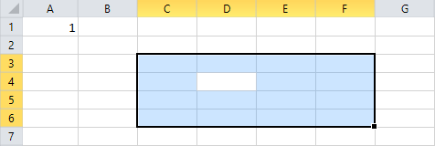
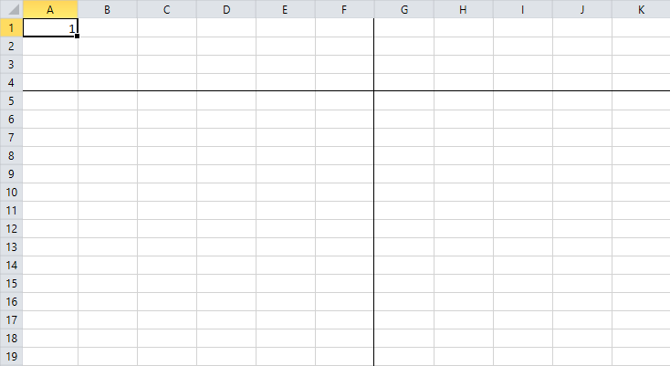
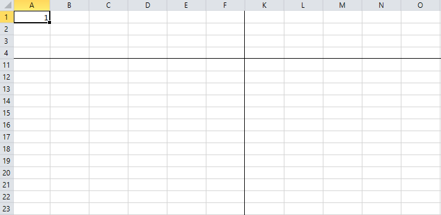

# Worksheet View Exporter

The `IWorksheetViewExporter` interface allows you to manipulate the way the exported document appears when opened in an application. This article explains the available members of the interface and how to use it.

* [Creating Worksheet View Exporter](#creating-worksheet-view-exporter)

* [Working with IWorksheetViewExporter](#working-with-iworksheetviewexporter)
	
	* [Change the First Visible Cell](#change-the-first-visible-cell)
	
	* [Add Selection to a Document](#add-selection-to-a-document)
	
	* [Scale a Document](#scale-a-document)
	
	* [Hide Grid Lines and Row or Column Headers](#hide-grid-lines-and-row-or-column-headers)
	
	* [Freeze Panes](#freeze-panes)
 
## Creating Worksheet View Exporter

You can create an instance of the `IWorksheetViewExporter` interface through the corresponding method of [IWorksheetExporter]().

**Example 1: Create IWorksheetViewExporter Instance**

<snippet id='libraries-spreadstream-features-worksheet-view-exporter-1'/>

>`IWorksheetViewExporter` inherits from [IDisposable](https://learn.microsoft.com/en-us/dotnet/api/system.idisposable). Make sure the object is disposed when you are done with it. Otherwise, the content will not be written in the exported file. The best way to ensure this is handled properly is to wrap it in a *using* statement.

## Working with IWorksheetViewExporter

The `IWorksheetViewExporter` interface allows you to perform the following operations:

### Change the First Visible Cell

With the `IWorksheetViewExporter` interface you can set the first visible cell. This cell is positioned at the top left position of the visible area when the document is rendered. **Example 2** shows how to generate a document containing one worksheet, which, when visualized, displays the C5 cell as the top left cell.

**Example 2: Export a Document with First Visible Cell C5**

<snippet id='libraries-spreadstream-features-worksheet-view-exporter-2'/>

### Add Selection to a Document

`IWorksheetViewExporter` defines methods that allow you to apply selection to the exported document so that it contains selection ranges when visualized. You can also change the position of the active cell in the selection.

**Example 3: Export a Document with Applied Multiple Selection Ranges**

<snippet id='libraries-spreadstream-features-worksheet-view-exporter-3'/>

**Example 4: Export a Document with Selection Range and Specified Active Cell of the Selection**

<snippet id='libraries-spreadstream-features-worksheet-view-exporter-4'/>

#### Figure 1: Selection with specified active cell

### Scale a Document

You can apply a scale factor to the exported document.

**Example 5: Set Scale Factor**

<snippet id='libraries-spreadstream-features-worksheet-view-exporter-5'/>

### Hide Grid Lines and Row or Column Headers

`IWorksheetViewExporter` enables you to set whether the resultant document is visualized with grid lines and headers. **Example 6** demonstrates how to hide both grid lines and row/column headers.

**Example 6: Hide Grid Lines and Row/Column Headers**

<snippet id='libraries-spreadstream-features-worksheet-view-exporter-6'/>

### Freeze Panes

You can freeze panes in the spreadsheet document through the `SetFreezePanes()` method.

**Example 7: Set Freeze Panes**

<snippet id='libraries-spreadstream-features-worksheet-view-exporter-7'/>

#### Figure 2: Frozen panes

An overload of the `SetFreezePanes()` method enables you to change the first visible cell of the scrollable pane (the right-bottom pane).

**Example 8: Set Freeze Panes and Change the First Visible Cell of the Scrollable Pane**

<snippet id='libraries-spreadstream-features-worksheet-view-exporter-8'/>

In **Figure 3**, you can see that the first visible cell of the scrollable pane is K11.

#### Figure 3: Frozen panes with modified first visible cell of the scrollable pane

## See Also

* [Workbook]()
* [Worksheet]()
* [Columns]()
* [Rows]()