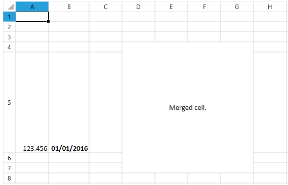

# Getting Started

This article will get you started in using the **RadSpreadStreamProcessing** library. It contains the following sections:

* [Assembly References](#assembly-references)

* [Supported Formats](#supported-formats)

* [Create a Spreadsheet Document](#create-a-spreadsheet-document)

## Assembly References

In order to use **RadSpreadStreamProcessing** in your project, you will need to add the references listed below.

* For **.NET Framework**:

	* **Telerik.Documents.SpreadsheetStreaming.dll**
	* **Telerik.Windows.Zip.dll**

	To describe different colors, shapes and other properties, **RadSpreadStreamProcessing** depends on the listed below .NET assemblies, which you should also refer in your project:

	* **WindowsBase.dll**
	* **PresentationFramework.dll**
	
* For **.NET Standard**:
	* **Telerik.Documents.SpreadsheetStreaming.dll**
	* **Telerik.Zip.dll**

## Create a Spreadsheet Document

This section will explain how a document could be created. If you need more detailed information about the classes that export the different document elements, you can check the articles from the [Model section]().

When creating a document with **RadSpreadStreаmProcessing**, you should have in mind that the order of filling the content is much important. To achieve the low resources usage, the library directly writes the necessary content in a stream and due to the format restrictions of the way the content is presented in the structure of the file, you have to create the desired elements in a sequence keeping the following consecution:

1. Create a Workbook 

2. Create a Worksheet

3. Create Columns (optional)

4. Create Rows (a worksheet must contain at least one row)

5. Create Cells (optional)

6. Merge Cells (optional)

**Example 2** shows how you could create a simple document.

#### **Example 1: Create a document**

{{region radspreadstreamprocessing-getting-started_0}}
	using (FileStream stream = File.OpenWrite("sample.xlsx"))
	{
	    using (IWorkbookExporter workbook = SpreadExporter.CreateWorkbookExporter(SpreadDocumentFormat.Xlsx, stream))
	    {
	        using (IWorksheetExporter worksheet = workbook.CreateWorksheetExporter("My sheet"))
	        {
	            worksheet.SkipColumns(1);
	            using (IColumnExporter column = worksheet.CreateColumnExporter())
	            {
	                column.SetWidthInPixels(80);
	            }
	
	            worksheet.SkipRows(3);
	            using (IRowExporter row = worksheet.CreateRowExporter())
	            {
	                row.SkipCells(3);
	                using (ICellExporter cell = row.CreateCellExporter())
	                {
	                    cell.SetValue("Merged cell.");
	                    cell.SetFormat(new SpreadCellFormat()
	                    {
	                        HorizontalAlignment = SpreadHorizontalAlignment.Center,
	                        VerticalAlignment = SpreadVerticalAlignment.Center
	                    });
	                }
	            }
	
	            using (IRowExporter row = worksheet.CreateRowExporter())
	            {
	                row.SetHeightInPixels(200);
	                using (ICellExporter cell = row.CreateCellExporter())
	                {
	                    cell.SetValue(123.456);
	                }
	
	                using (ICellExporter cell = row.CreateCellExporter())
	                {
	                    SpreadCellFormat format = new SpreadCellFormat()
	                    {
	                        NumberFormat = "dd/mm/yyyy",
	                        IsBold = true
	                    };
	                    cell.SetFormat(format);
	                    cell.SetValue(42370);
	                }
	            }
	
	            worksheet.MergeCells(3, 3, 6, 6);
	        }
	    }
	}
{{endregion}}

**Figure 1** shows the result of executing the code from **Example 1**.

#### Figure 1: The document created in Example 2

## See Also 

* [Rows]()
* [Columns]()
* [Cells]()
* [Worksheets]()
* [Workbook]()
