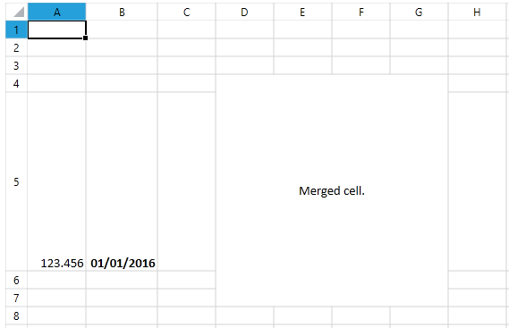

# Getting Started

**RadSpreadStreamProcessing** enables you to create and read spreadsheet documents with high performance and minimal memory consumption.

>note If you still do not have **Telerik Document Processing** installed, check the **[First Steps]()** topic to learn how you can get the packages through the different suites. 

## Package References

You can find the required references in the [SpreadStreamProcessing NuGet packages](#spreadstreamprocessing-packages) section.

## Create a Spreadsheet Document

This section explains how to create a document. If you need more detailed information about the classes that export the different document elements, check the articles from the [Model section]().

When you create a document with **RadSpreadStreamProcessing**, the order in which the elements are created is very important. To minimize resource consumption, the library writes the content directly to a stream, and due to the structure of the file format, you must create the elements in the following order:

1. Create a Workbook 

2. Create a Worksheet

3. Create Columns (optional)

4. Create Rows (a worksheet must contain at least one row)

5. Create Cells (optional)

6. Merge Cells (optional)

**Example 1** shows how to create a simple document.

**Example 1: Create a Document**

<snippet id='codeblock-dkn'/>

**Figure 1** shows the result of executing the code from **Example 1**.

#### Figure 1: The document created in Example 1

## Read Existing Document

When you read a document with **RadSpreadStreamProcessing**, the order of parsing the content is very important. To minimize resource consumption, the library parses only the parts required by the user and, due to the file structure, you must read the desired elements in the following order:

1. Read the Workbook 

2. Read a Worksheet

3. Read Columns (optional)

4. Read Rows (a worksheet must contain at least one row)

5. Read Cells (optional)

**Example 2** demonstrates how to read the data from an existing document.

**Example 2: Read Data from a Document**

<snippet id='codeblock-dko'/>

For more complete examples, go to the [Developer Focused Examples]() section of the library.

## See Also 

* [Using Telerik Document Processing First Steps]()
* [Rows]()
* [Columns]()
* [Cells]()
* [Worksheets]()
* [Workbook]()
* [Accessing Specific Cells in RadSpreadStreamProcessing]()
* [Editing Cell Values of Existing Documents using SpreadStreamProcessing]()
