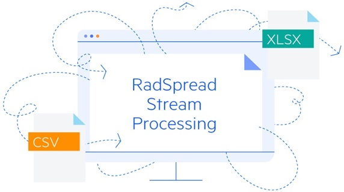
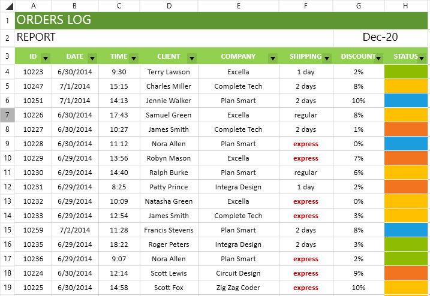

# Overview

The Telerik SpreadStream Processing Library allows you to generate large spreadsheet documents with great performance and minimal memory footprint in your .NET applications. It is specialized for fast generation of large (even 1M+ rows) XLSX and CSV documents. The document model has no external dependencies on third-party software or UI. You can process Microsoft Excel supported documents without having Microsoft Excel, Microsoft Office, or any other external library installed on the client or server.

  

To skip this introductory article and directly start using SpreadStreamProcessing, see the [Getting Started with RadSpreadStreamProcessing]() topic.

>note If you still do not have Telerik Document Processing installed, check the [First Steps]() topic to learn how you can get the packages through the different suites with Telerik controls.

>tip You can find the code example from the previous image in the [SDK repository on GitHub](https://github.com/telerik/document-processing-sdk/tree/master/SpreadStreamProcessing/GenerateDocument). This repository contains many examples that cover all Document Processing libraries.

## What Is Spread Streaming

Spread streaming is a document processing paradigm that allows you to create or read large spreadsheet documents with great performance and minimal memory footprint.

The key for the memory efficiency is that the spread streaming library writes the spreadsheet content directly to a stream without creating and preserving the spreadsheet document model in memory. Each time an exporter object is disposed, the set values are written into the stream. This allows you to create large documents with excellent performance.

While reading, `RadSpreadStreamProcessing` parses only the required chunk of information. This ensures minimal use of application resources.

## Key Features

The following list describes the features you can take advantage of:

* Specialized for fast generation of large (even 1M+ rows) XLSX and CSV documents.

* Create a document from scratch or append new sheets to an existing document.

* Faster than SpreadProcessing and with minimal memory footprint.

* [Export to XLSX or CSV files]().

* [Import from XLSX or CSV files]().

* Write directly into a stream, or parse only required data.

* **Append** new worksheets to an existing workbook.

* **Grouping**: Organize data in sections and show or hide the currently relevant chunks.

* **Hidden [rows]() and [columns]()**: The API allows you to set the hidden state of each row or column.

* [**AutoFilter**](): Set AutoFilters to show or hide rows based on column values. Supports value, custom comparison, top/bottom N, and dynamic date filters.

* [**Cell formatting**](#set-a-format): Several properties enable you to apply the desired look to a cell.

* [**Cell styles**](): Cell styles allow you to apply multiple format options in one step and achieve consistency in cell formatting.

* [**Merge cells**](#merge-cells): Merge two or more adjacent cells into a single cell that spans over multiple rows and columns.

* **Controlling the view state of a sheet:**
	* [Setting scale factor](#scale-a-document)
	* [Control over the selection and the active cell](#add-selection-to-a-document)
	* [Show/hide gridlines](#hide-grid-lines-and-row-or-column-headers)
	* [Show/hide row and column headers](#ide-grid-lines-and-row-or-column-headers)
	* [Freezing panes](#freeze-panes): Keep part of the worksheet always visible while scrolling.
	* [Changing the first visible cell](#change-the-first-visible-cell): Show a particular part of the sheet to the user when opening the document in a viewer.
	

## RadSpreadStreamProcessing versus RadSpreadProcessing

The main differences between the two spreadsheet processing libraries include:

* `RadSpreadStreamProcessing` writes directly into a stream, while [RadSpreadProcessing]() creates models for the elements in the document. This is why the spread streaming library uses significantly less memory than `RadSpreadProcessing`.
* `RadSpreadStreamProcessing` does not perform any formula or other layout-related calculations, which makes its file generation performance much better compared to `RadSpreadProcessing`.

## When to Use RadSpreadStreamProcessing

You can use the `RadSpreadStreamProcessing` library to create or read large amounts of data with a low memory footprint and great performance. You can also append data to an already existing document stream. The generated document can be exported directly to a file on the file system or to a stream (for example, to send it to the client).

## Online Demos

| Demo | Description |
|------|-------------|
| [SpreadStreamProcessing Large Document Export](https://demos.telerik.com/document-processing/spreadstreamprocessing) | With the SpreadStreamProcessing APIs, you can generate large XLSX and CSV files. |
| [SpreadStreamProcessing Import Document](https://demos.telerik.com/document-processing/spreadstreamprocessing/import_document) | This example shows how you can retrieve data from XLSX or CSV files using the SpreadStreamProcessing library. |

## See Also

* [Getting Started]()
* [Workbook]()
* [Worksheet View Exporter]()
* [RadSpreadProcessing]()
