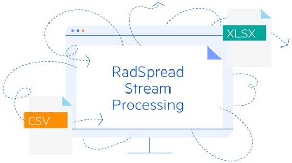
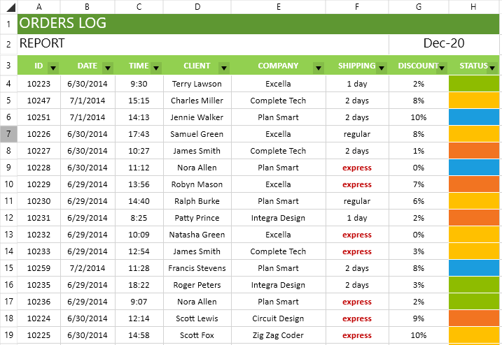

# Overview

Telerik Document Processing includes the **RadSpreadStreamProcessing** library for importing and exporting large spreadsheet files with a low memory footprint. Use the `SpreadExporter` and `SpreadImporter` APIs to process XLSX and CSV documents sequentially. The library has no dependency on Microsoft Excel, Microsoft Office, or third-party UI components.

  

To skip this introductory article, see [how to get started with RadSpreadStreamProcessing]().

>note If you do not yet have Telerik Document Processing installed, see [the first steps for installation]().

>tip You can find the code sample from the previous image in the [Document Processing SDK repository on GitHub](https://github.com/telerik/document-processing-sdk/tree/master/SpreadStreamProcessing/GenerateDocument).

## What Is Spread Streaming

Spread streaming is a document-processing approach that lets you create or read large spreadsheet documents with high performance and low memory use.

The library saves memory by writing spreadsheet content directly to a stream instead of keeping a full workbook model in memory. Exporters write content as you create worksheets, rows, and cells, and finalize the file when you dispose them.

During import, `RadSpreadStreamProcessing` parses only the required data chunk. This approach helps keep CPU and memory use low.

## Key Features

The library supports the following features:

* Generate large XLSX and CSV documents (1M+ rows).
* Create documents from scratch, or append worksheets to existing workbooks.
* [Export to XLSX and CSV files]().
* [Import from XLSX and CSV files]().
* Write directly to a stream, or read only the required data.
* Use less memory than [RadSpreadProcessing]() for large-file scenarios.

* **Append** new worksheets to an existing workbook.

* **Grouping**: Organize data in sections, and show or hide the relevant ranges.
* Hidden [rows]() and [columns](): Set the hidden state of each row or column.
* [AutoFilter](): Show or hide rows based on column values. `AutoFilter` supports value, custom comparison, top or bottom N, and dynamic date filters.
* [Cell formatting](#set-a-format): Apply the required appearance to cells.
* [Cell styles](): Apply multiple format options in one step and keep formatting consistent.
* [Merge cells](#merge-cells): Merge adjacent cells across multiple rows and columns.

You can also control the view state of a sheet:

* [Set the scale factor](#scale-a-document).
* [Control the selection and active cell](#add-selection-to-a-document).
* [Show or hide gridlines](#hide-grid-lines-and-row-or-column-headers).
* [Show or hide row and column headers](#hide-grid-lines-and-row-or-column-headers).
* [Freeze panes](#freeze-panes) to keep part of the worksheet visible while scrolling.
* [Change the first visible cell](#change-the-first-visible-cell) to control the part of the sheet that appears when a viewer opens the document.

## RadSpreadStreamProcessing versus RadSpreadProcessing

The main differences between the two spreadsheet processing libraries include:

* `RadSpreadStreamProcessing` writes directly to a stream, while [RadSpreadProcessing]() builds an in-memory document model. As a result, the streaming library uses much less memory.
* **RadSpreadStreamProcessing** does not run formula or layout-related calculations, so file generation is faster than with **RadSpreadProcessing**.

## When to Use RadSpreadStreamProcessing

Use the `RadSpreadStreamProcessing` library when you need to create or read large datasets with low memory use. You can also append data to an existing document stream. Export the generated document directly to a file or stream, for example, to send it to a client.

## Online Demos

The following demos show common `RadSpreadStreamProcessing` scenarios:

| Demo | Description |
|---|---|
| [SpreadStreamProcessing Large Document Export](https://demos.telerik.com/document-processing/spreadstreamprocessing) | With the SpreadStreamProcessing APIs, you can generate large XLSX and CSV files. |
| [SpreadStreamProcessing Import Document](https://demos.telerik.com/document-processing/spreadstreamprocessing/import_document) | This example shows how you can retrieve data from XLSX or CSV files using the SpreadStreamProcessing library. |

## See Also

* [Getting Started]()
* [Workbook]()
* [Worksheet View Exporter]()
* [RadSpreadProcessing]()
