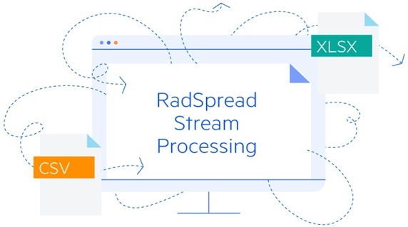

# Overview

**Telerik SpreadStream Processing Library** allows you to generate big spreadsheet documents with great performance and minimal memory footprint in your .NET applications, specialized for fast generation of huge (even 1M+ rows) XLSX and CSV documents. The document model has no external dependencies on third-party software or UI. Users are able to process Microsoft Excel supported documents even without having Microsoft Excel, Microsoft Office or any other external library installed on the client or server. 

  

If you want to skip this introductory article and directly start using SpreadStreamProcessing, take a look at the **[Getting Started with RadSpreadStreamProcessing]()** help topic.

>noteIf you still don't have **Telerik Document Processing installed**, check the **[First Steps]()** topic to learn how you can obtain the packages through the different suites with Telerik controls.

>tipYou can find the code example from the image above in our [SDK repository on GitHub](https://github.com/telerik/document-processing-sdk/tree/master/SpreadStreamProcessing/GenerateDocument). This repository contains numerous examples that cover all Document Processing libraries.

## What is Spread Streaming?

Spread streaming is a document processing paradigm that allows you to create or read big spreadsheet documents with great performance and minimal memory footprint. 

The key for the memory efficiency is that the spread streaming library writes the spreadsheet content directly to a stream without creating and preserving the spreadsheet document model in memory. Each time an exporter object is disposed, the set values are written into the stream. This allows you to create large documents with excellent performance.

While reading, RadSpreadStreamProcessing parses only the required chunk of information. This ensures minimal use of application resources. 

## Key Features 

Some of the features you can take advantage of are:

* Specialized for fast generation of huge (even 1M+ rows) XLSX and CSV documents.

* Create document from scratch or append new sheets to existing document.

* Faster than Spread Processing and with minimal memory footprint.

* [Export to XLSX or CSV files]().

* [Import from XLSX or CSV files](). 

* Write directly into a stream; or parse only required data.

* **Append** new worksheets to existing workbook

* **Grouping**: Helps you organize data in sections, to be able to show and hide the currently relevant chunks.

* **Hidden [rows]() and [columns]()**: The API allows you to set the hidden state of each row or column.

* [**Cell formatting**](#set-a-format): A number of properties enabling you to apply the desired look to a cell.

* [**Cell styles**](): Using cell styles allows you to apply multiple format options in one step and also offers an easy approach to achieve consistency in cell formatting.

* [**Merge cells**](#merge-cells): You have the ability to merge two or more adjacent cells into a single cell that spans over multiple rows and columns.

* **Controlling the view state of a sheet:**
	* [Setting scale factor](#scale-a-document)
	* [Control over the selection and the active cell](#add-selection-to-a-document)
	* [Show/hide gridlines](#hide-grid-lines-and-row-or-column-headers)
	* [Show/hide row and column headers](#ide-grid-lines-and-row-or-column-headers)
	* [Freezing panes](#freeze-panes): Keep part of the worksheet always visible while scrolling.
	* [Changing the first visible cell](#change-the-first-visible-cell): when you would like to show a particular part of the sheet to the user on opening the document in a viewer.
	

## RadSpreadStreamProcessing vs. RadSpreadProcessing

The main differences between the two spreadsheet processing libraries include:

* __RadSpreadStreamProcessing__ writes directly into a stream, while [RadSpreadProcessing]() creates models for the elements in the document. This is why the spread streaming library uses significantly less memory than __RadSpreadProcessing__.
* __RadSpreadStreamProcessing__ does not perform any formula or other layout-related calculations, which makes its file generation performance much better compared to __RadSpreadProcessing__.

## When to Use RadSpreadStreamProcessing

You can use the __RadSpreadStreamProcessing__ library to create or read __large amount of data__ with a low memory footprint and great performance. You can also append data to an already existing document stream. The generated document can be exported directly to a file on the file system or to a stream (for example, to send it to the client).

## See Also

* [Getting Started]()
* [Workbook]()
* [Worksheet View Exporter]()
* [RadSpreadProcessing]()
