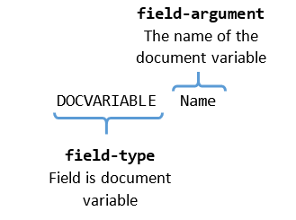

# Document Variables

**Document Variables** provide a mechanism to store information in the document in a key-value format. [DocumentVariableField](https://docs.telerik.com/devtools/document-processing/api/telerik.windows.documents.flow.model.fields.documentvariablefield) is a [Field]() element used to access and display the value, which corresponds to the given field-argument. The argument is the name of the variable.
      

## DocumentVariableCollection

[RadFlowDocument]() has a __DocumentVariableCollection__ property, which holds document variable records. The collection maps string keys to string values. You can add a record in it through an indexer or with the collection's __Add()__ method. __Example 1__ demonstrates both approaches.
        

#### __[C#] Example 1: Add document variable record__

{{region cs-radwordsprocessing-concepts-document-variables_0}}
	            
	RadFlowDocument document = new RadFlowDocument();
	document.DocumentVariables["Job"] = "Software Engineer";
	document.DocumentVariables.Add("Name", "Nancy Davolio");
{{endregion}}

The code in __Example 1__ adds two document variables – *"Name"*, which will be evaluated to *"Nancy Davolio"*, and *"Job"* with *"Software Engineer"* value.
        

The same two methods can be used to modify the value of an existing variable in the collection.
        

Removing defined variables can be achieved by using the __Remove()__ method of the variables collection. It accepts the name of the variable as a parameter.
        

#### __[C#] Example 2: Remove document variable record__

{{region cs-radwordsprocessing-concepts-document-variables_1}}
	        
	document.DocumentVariables.Remove("Job");
{{endregion}}

## Field Syntax

| Syntax   				     |
| :---     				     |
| { **DOCVARIABLE** "Name" } |  

The syntax of a document variable field code is pretty simple as demonstrated on __Figure 1__.
        

#### Figure 1: Document variable field code syntax

## Inserting

A __DocumentVariable__ field can be inserted through [RadFlowDocumentEditor]()'s __InsertField()__ method. 
__Example 3__ shows insertion of the field created in __Example 1__.
        

#### __[C#] Example 3: Insert document variable field__

{{region cs-radwordsprocessing-concepts-document-variables_2}}
	editor.InsertField("DOCVARIABLE Name", "Nancy Davolio");
{{endregion}}

## See Also

 * [Fields]()
 * [RadFlowDocument]()
