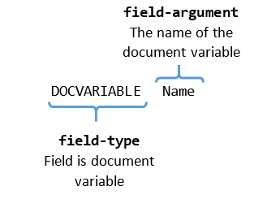

# Document Variables

*Document variables* provide a mechanism to store information in the document in a key-value format. [`DocumentVariableField`](https://docs.telerik.com/devtools/document-processing/api/telerik.windows.documents.flow.model.fields.documentvariablefield) is a [Field]() element used to access and display the value that corresponds to the given field-argument. The argument is the name of the variable.

## DocumentVariableCollection

[`RadFlowDocument`]() has a `DocumentVariableCollection` property, which holds document variable records. The collection maps string keys to string values. You can add a record through an indexer or with the collection's `Add()` method. **Example 1** demonstrates both approaches.

**Example 1: Add Name and Job records to the document variable collection**

<snippet id='codeblock-oo'/>

The code in **Example 1** adds two document variables—*"Name"*, which evaluates to *"Nancy Davolio"*, and *"Job"* with a *"Software Engineer"* value.

You can use the same two methods to modify the value of an existing variable in the collection.

To remove defined variables, use the `Remove()` method of the variables collection. It accepts the name of the variable as a parameter.

**Example 2: Remove the Job document variable from the collection**

<snippet id='codeblock-pp'/>

## Field Syntax

| Syntax   				     |
| :---     				     |
| { **DOCVARIABLE** "Name" } |

The syntax of a document variable field code is demonstrated in **Figure 1**.

**Figure 1: Document variable field code syntax**

## Inserting

You can insert a `DocumentVariableField` through the [`RadFlowDocumentEditor`]()'s `InsertField()` method.
**Example 3** shows insertion of the field created in **Example 1**.

**Example 3: Insert a DOCVARIABLE field that displays the Name document variable value**

<snippet id='codeblock-qq'/>

## See Also

* [Fields]()
* [RadFlowDocument]()
