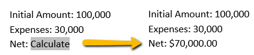

# Expression Field

[ExpressionField](https://docs.telerik.com/devtools/document-processing/api/telerik.windows.documents.flow.model.fields.expressionfield) or "**= (Formula)**" field code is a [Field]() element that calculates a number by using a mathematical formula.

## Field Syntax

This is how the syntax of an Expression field looks like:

| Syntax   											     |
| :---     											     |
| { **= Formula** [_Bookmark_ ] [_\\#Numeric Picture_ ] } |

### Operators
In an Expression field, you can use any combination of values and the following mathematical and relational operators.

| Operator | Description              |
| :---     | :---                     |
| +        | Addition                 |
| –        | Subtraction              |
| *        | Multiplication           |
| /        | Division                 |
| %        | Percentage               |
| ^        | Powers and roots         |
| =        | Equal to                 |
| <        | Less than                |
| <=       | Less than or equal to    |
| >        | Greater than             |
| >=       | Greater than or equal to |
| <>       | Not equal to             |
| +        | Addition                 |

### Functions
| Operator   | Description                                                                                                                                     |
| :---       | :---                                                                                                                                            |
| ABS(x)     | Returns the positive value of a number or formula, regardless of its actual positive or negative value.                                         |
| AND(x,y)   | Returns the value 1 if the logical expressions x and y are both true, or the value 0 (zero) if either expression is false.                      |
| AVERAGE()  | Returns the average of a list of values.                                                                                                        |
| COUNT()    | Returns the number of items in a list.                                                                                                          |
| DEFINED(x) | Returns the value 1 (true) if the expression x is valid, or the value 0 (false) if the expression cannot be computed.                           |
| FALSE      | Returns 0 (zero).                                                                                                                               |
| INT(x)     | Returns the numbers to the left of the decimal place in the value or formula x.                                                                 |
| MIN()      | Returns the smallest value in a list.                                                                                                           |
| MAX()      | Returns the largest value in a list.                                                                                                            |
| MOD(x,y)   | Returns the remainder that results from dividing the value x by the value y a whole number of times.                                            |
| NOT(x)     | Returns the value 0 (zero) (false) if the logical expression x is true, or the value 1 (true) if the expression is false.                       |
| OR(x,y)    | Returns the value 1 (true) if either or both logical expressions x and y are true, or the value 0 (zero) (false) if both expressions are false. |
| PRODUCT()  | Returns the result of multiplying a list of values. For example, the function { = PRODUCT (1,3,7,9) } returns the value 189.                    |
| ROUND(x,y) | Returns the value of x rounded to the specified number of decimal places y; x can be either a number or the result of a formula.                |
| SIGN(x)    | Returns the value 1 if x is a positive value, or the value –1 if x is a negative value.                                                         |
| SUM()      | Returns the sum of a list of values or formulas.                                                                                                |
| TRUE       | Returns the value 1.                                                                                                                            |

### Bookmark
The name of a bookmark that refers to one or more values.

### \\# Numeric picture
Specifies the display of a numeric result. This switch is called a "picture" switch because you use symbols to represent the format of the field result. Check the implementation in **Example 1** and its result in **Figure 1**.

#### Picture items

| Operator                   | Description                                                                                                          |
| :---                       | :---                                                                                                                 |
| 0 (zero)                   | Specifies the requisite numeric places to display in the result. For example, { = 1 + 2 \# 00.00 } displays "03.00". |
| #                          | Specifies the requisite numeric places to display in the result. For example, { = 1 + 2 \# ###лв. } displays "3лв.". |
| x                          | Drops digits to the left of the "x" placeholder.                                                                     |
| . (decimal symbol)         | Determines the decimal point position. For example, { = SUM(1, 2) \# $###.00 } displays "$3.00".                     |
| , (digit grouping symbol)  | Separates a series of three digits. For example, { = Sales \# $#,###,### } displays "$12,345,678".                   |
| -                          | Adds a minus sign to a negative result, or adds a space if the result is positive or 0 (zero). For example, { = 99 - 100 \# -## } displays "-1". |
| +                          | Adds a plus sign to a positive result, a minus sign to a negative result, or a space if the result is 0 (zero). For example, { = 10 - 9 \# +## } displays "+1", and { = 9 - 10 \# +## } displays "-1".  |
| %, лв., *, and so on       | Includes the specified character in the result. For example, { = Proportion \# "##%" } displays "12%". |
| "positive; negative"       | Specifies different number formats for positive and negative results. For example, if the bookmark Sales is a positive value, the field { Sales \# "$#,##0.00;-$#,##0.00" } displays the value with regular formatting ("$100,000.00"). A negative value is displayed with bold formatting and a minus sign ("-$100.00"). |
| "positive; negative; zero" | Specifies different number formats for a positive result, a negative result, and a 0 (zero) result. For example, depending on the value of the Sales bookmark, { Sales \# "$#,##0.00;($#,##0.00);$0" } displays positive, negative, and 0 (zero) values as follows: $100,000.00, ($100.00), $0 |
| 'text'                     | Adds text to the result. Enclose the text in single quotation marks. For example, { = { Sales }  \# "$##0.00 'is the initial amount.' " } displays "$100000.00 is the initial amount.". |

>On Windows, use the decimal symbol (".") or the digit grouping symbol (",") specified as part of the regional settings in Control Panel.

## Inserting

Inserting an Expression Field is easily achieved through the [RadFlowDocumentEditor]()'s **InsertField()** method. It accepts code as first argument and result as second argument.
       

#### __[C#] Example 1: Insert an Expression field__

<snippet id='codeblock-rr'/>

The result is shown in Figure 1.

#### Figure 1: Expression field and bookmarks in a document
  

## See Also

 * [Fields]()
 * [Custom Code Field]()
 * [RadFlowDocumentEditor]()
