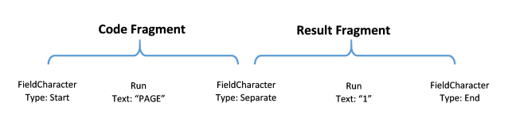

# Fields

__Fields__ in the __RadFlowDocument__ model are special constructions that hold data, which can change/be updated – for example page numbers or merge fields. Fields consist of field code and field result. The field code fragment defines how the field result should be calculated when the field is updated. The field result fragment holds the latest calculated result. In the model these two fragments are separated by a special type of inline – [FieldCharacter](). __FieldCharacters__ are 3 types:
      

* __Start__: Defines the start of the field.
* __End__: Defines the end of the field.
* __Separate__: Separates the code and result fragments.
          

The inlines between the __start__ and __separate__ field characters form the __code fragment__ and the inlines between the __separate__ and __end__ field characters form the __result fragment__.
      

Here is how simple page field looks like inside the document:

In the document object model Fields are represented by the [Field](https://docs.telerik.com/devtools/document-processing/api/Telerik.Windows.Documents.Flow.Model.Fields.Field.html) abstract class, which holds references to the __Start__, __Separate__ and __End__ field characters that are related to the field.

## Supported Fields

<!-- alphabetized list below -->
* **[Compare Field]()**

* **[Custom Code Field]()**

* **[Date Field]()**

* **[Document Variable Field]()**

* **[Expression Field]()**

* **[Hyperlink Field]()**

* **[If Field]()**

* **[Merge Field]()**

* **[Time Field]()**

* **[PageRef]()**

* **[Page]()**

* **[NumPages]()**

* **[Section]()**

* **[Section Pages]()**

* **[SeqField]()**

* **[TOC]()**
  
* **[TC]()**
  
* **[TOA]()**
  
* **[TA]()**

## Inserting Fields

The suggested way to insert field is to use the __InsertField()__ method of [RadFlowDocumentEditor]() class. It takes care of creating and inserting the code and result fragments as well as placing the appropriate field character inlines to separate them. The __InsertField()__ method returns an instance of the __FieldInfo__ class. It holds references to the start, separate and end field characters and also provides an API for getting the code and result fragments and updating the field.
        

#### __[C#] Example 1: Create a document containing a Date field using RadFlowDocumentEditor__

{{region cs-radwordsprocessing-concepts-fields_0}}
	            
	RadFlowDocument document = new RadFlowDocument();
	RadFlowDocumentEditor editor = new RadFlowDocumentEditor(document);
	editor.InsertField("DATE", "«10/11/2012»");
{{endregion}}

You can also create and insert all the parts of the field manually by creating a __FieldInfo__ instance and adding all the inlines to the document structure. **Example 2** demonstrates how to achieve the same result as in **Example 1**.
        
#### __[C#] Example 2: Create a document containing a Date field using the RadDocument model and FieldInfo__

{{region cs-radwordsprocessing-concepts-fields_1}}
	            
	// Create a document with a paragraph.
	RadFlowDocument document = new RadFlowDocument();
	Paragraph paragraph = document.Sections.AddSection().Blocks.AddParagraph();
	
	// Create the field info.
	FieldInfo field = new FieldInfo(document);
	            
	// Create and add all the inlines to the paragraph.
	paragraph.Inlines.Add(field.Start);
	paragraph.Inlines.AddRun("AUTHOR");
	paragraph.Inlines.Add(field.Separator);
	paragraph.Inlines.AddRun("John Doe");
	paragraph.Inlines.Add(field.End);
{{endregion}}

You can see that the manual approach is more verbose and prone to errors. If not all of the field characters are inserted the result is an invalid document. Using the __RadFlowDocumentEditor__ on the other hand, guarantees that the document integrity is maintained.
        
## Updating Fields

__RadWordsProcessing__ supports updating of some fields types. When a field is updated, its result fragment is replaced with the calculated result value. Also the __Field__ property of the corresponding __FieldInfo__ object will be initialized to an instance of a __Field__ class that matches the recognized field type.
        
Here is a list of the field types that support updating:

* Formulas and Expressions (formulas and expressions begin with "=") 
* IF
* COMPARE
* DATE
* TIME
* HYPERLINK
* SECTION

If the field type is not one of the above, the result will not be updated and the Field property of the FieldInfo class will be set to an instance of a CustomCodeField. The complete list of field codes and the switches for each of them can be found in the [Docx specification](http://www.ecma-international.org/publications/standards/Ecma-376.htm).

### Updating PageRef, Page, NumPages, and SectionPage fields. 

In R3 2022 the above fields were introduced. Their evaluation requires calculating the size of the document elements. This is why to update them you need to provide an implementation of a [**NumberingFieldsProvider**]() which can provide the needed layout logic. In the default implementation we are using the the layout logic from the [RadPdfPRocessing]() library. To use it you need to add reference to the following assembly: 

* **Telerik.Windows.Documents.Fixed**

You can register the provider with the following code:

#### __[C#] Example 3: Register the default NumberingFieldsProvider__

{{region cs-radwordsprocessing-concepts-fields_5}}

	 FlowExtensibilityManager.NumberingFieldsProvider = new NumberingFieldsProvider();

{{endregion}}

Updating a single field is done with the __UpdateField()__ method of the __FieldInfo__ class as demonstrated in **Example 3**.

#### __[C#] Example 4: Update a field__

{{region cs-radwordsprocessing-concepts-fields_2}}
	            
	RadFlowDocumentEditor editor = new RadFlowDocumentEditor(new RadFlowDocument());
	FieldInfo fieldInfo = editor.InsertField("DATE \\@ dd/MM/yyyy", "«result»");
	Console.WriteLine(fieldInfo.GetResult()); // Output: result
	fieldInfo.UpdateField();
	Console.WriteLine(fieldInfo.GetResult()); // Output: 06/06/2014
{{endregion}}

>Note that field result is not automatically updated upon insertion. The initial result fragment is passed as a parameter to the __InsertField()__ method.

All fields in the document can be updated using __UpdateFields()__ of __RadFlowDocument__. **Example 4** shows how to use this method.        

#### __[C#] Example 5: Update all fields in a document__

{{region cs-radwordsprocessing-concepts-fields_3}}
	            
	RadFlowDocument document = new RadFlowDocument();
	RadFlowDocumentEditor editor = new RadFlowDocumentEditor(document);
	FieldInfo fieldInfo = editor.InsertField("DATE \\@ dd/MM/yyyy", "«result»");
	        
	Console.WriteLine(fieldInfo.GetResult()); // Output: result
	document.UpdateFields();
	Console.WriteLine(fieldInfo.GetResult()); // Output: 06/06/2014
{{endregion}}

## Syntax and Switches

The syntax of a field code is as follows:

| Syntax   		                             |
| :---     					                 |
| **field-type** [field-argument] [switches] |

* *field-type*: The type of the field. For example: HYPERLINK.  

* _argument_: The argument of the field. This is optional as some of the fields do not require an argument.

* _switches_: One or several additional properties of the field. 
  The syntax of a switch is the following:   

	| Syntax   		                      |
	| :---     					          |
	| _\switch-character_ _[switch-argument]_ |

    * _switch-character_: Character defining the switch. For example, the "\o" switch for HYPERLINK fields defines the tooltip switch.

    * _switch-argument_: The argument of the switch. The argument is optional as not all switches require an argument.
                

Below is an example of field code:
       

## Nested Fields

Fields can also be nested in each other. If there are nested fields inside the code fragment of a field – their result will be used when calculating the result of the outer field.

**Example 5** creates a field, which will be evaluated to appropriate greeting based on the time of the day.

#### __[C#] Example 6: Create a nested field__

{{region cs-radwordsprocessing-concepts-fields_4}}
	            
	RadFlowDocumentEditor editor = new RadFlowDocumentEditor(new RadFlowDocument());
	            
	// Create an outer field with empty code fragment.
	FieldInfo outerFieldInfo = editor.InsertField(string.Empty, "if field result");
	            
	// Move the editor after the field start character.
	editor.MoveToInlineEnd(outerFieldInfo.Start);
	        
	// Create a code fragment with a nested TIME field.
	editor.InsertText("IF ");
	editor.InsertField("TIME \\@ HH", "time field result");
	editor.InsertText(" < 12 \"Good morning!\" \"Good afternoon!\"");
	
	outerFieldInfo.UpdateField();
	Console.WriteLine(outerFieldInfo.GetResult()); // Output: Good afternoon!
{{endregion}}

When calling the UpdateField() method all nested fields inside the code fragment of the field are also be updated. This is also true when using the UpdateFields() method of RadFlowDocument.

## FieldInfo Class

__FieldInfo__ is the main entry point when working with fields. It serves as "glue" between the start, separate and end field characters of a field. Each field character also holds a reference to its FieldInfo class through the FieldInfo property.

>The only way to create __FieldCharacter__ is by creating __FieldInfo__ instance. To preserve the document integrity all field characters should be inserted and removed from the document together. If the RadFlowDocumentEditor class is used for insertion – this is done automatically.

__FieldInfo__ exposes several properties and methods for working with fields:

* __Start__: A reference to the Start field character.
* __Separator__: A reference to the Separator field character.
* __End__: A reference to the End field character.
* __IsLocked__: Specifies if the field is locked. Locked fields are not updated.
* __IsDirty__: Specifies if the field should be updated before it is displayed. This property is useful when creating a document and you want to assure the field is updated when the document is opened by an application.
* __UpdateField()__: Recalculates the field result fragment and updates the Field property.
* __GetCode()__: Gets the current code fragment as a string.
* __GetResult()__: Gets the current result fragment as a string.
* __Field__: Gets the current Field object (e.g. DateField) associated to the field info. Note, that this property is updated every time the field is updated.    

When exporting documents to DOCX format you can use the __IsDirty__ property of an individual fields or the __AutoUpdateFields__ property of the export settings of the __DocxFormatProvider__, which will cause the consumer to update the fields when the document is opened. More information about the export settings of the provider is available [here]().
        

## See Also

 * [Document model]()
 * [FieldCharacter]()
 * [RadFlowDocumentEditor]()
