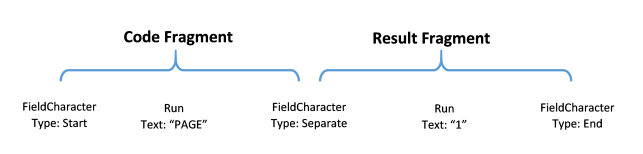
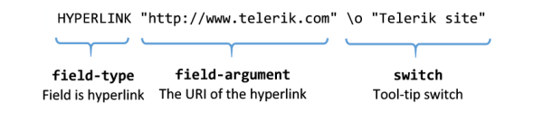
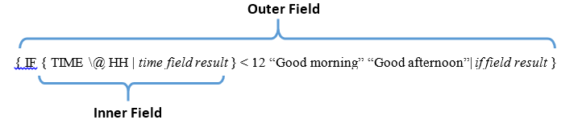

# Fields

Fields in the `RadFlowDocument` model are special constructions that hold data, which can change or be updated. Examples include page numbers and merge fields. Fields consist of a field code and a field result. The field code fragment defines how the field result is calculated when the field is updated. The field result fragment holds the latest calculated result. In the model, these two fragments are separated by a special type of inline—[FieldCharacter](). `FieldCharacter` instances are three types:

| Type | Description |
|---|---|
| `Start` | Defines the start of the field. |
| `End` | Defines the end of the field. |
| `Separate` | Separates the code and result fragments. |

The inlines between the start and separate field characters form the code fragment. The inlines between the separate and end field characters form the result fragment.

Here is how a simple page field looks inside the document:

In the document object model, fields are represented by the [Field](https://docs.telerik.com/devtools/document-processing/api/Telerik.Windows.Documents.Flow.Model.Fields.Field.html) abstract class. This class holds references to the `Start`, `Separate`, and `End` field characters that are related to the field.

## Supported Fields

<!-- alphabetized list below -->
* **[Compare Field]()**

* **[Custom Code Field]()**

* **[Date Field]()**

* **[Document Variable Field]()**

* **[Expression Field]()**

* **[Hyperlink Field]()**

* **[If Field]()**

* **[Merge Field]()**

* **[Time Field]()**

* **[PageRef]()**

* **[Page]()**

* **[NumPages]()**

* **[Section]()**

* **[Section Pages]()**

* **[SeqField]()**

* **[TOC]()**
  
* **[TC]()**
  
* **[TOA]()**
  
* **[TA]()**

## Inserting Fields

The recommended way to insert a field is to use the `InsertField()` method of the [RadFlowDocumentEditor]() class. It takes care of creating and inserting the code and result fragments as well as placing the appropriate field character inlines to separate them. The `InsertField()` method returns an instance of the `FieldInfo` class. It holds references to the start, separate, and end field characters and also provides an API for getting the code and result fragments and updating the field.

**Example 1: Create a document and insert a DATE field with RadFlowDocumentEditor**

<snippet id='codeblock-ss'/>

You can also create and insert all the parts of the field manually by creating a `FieldInfo` instance and adding all the inlines to the document structure. **Example 2** demonstrates how to achieve the same result as in **Example 1**.

**Example 2: Manually construct an AUTHOR field with FieldInfo and explicit field characters**

<snippet id='codeblock-tt'/>

The manual approach is more verbose and prone to errors. If not all of the field characters are inserted, the result is an invalid document. Using the `RadFlowDocumentEditor`, on the other hand, guarantees that the document integrity is maintained.

## Updating Fields

RadWordsProcessing supports updating of some field types. When a field is updated, its result fragment is replaced with the calculated result value. Also, the `Field` property of the corresponding `FieldInfo` object is initialized to an instance of a `Field` class that matches the recognized field type.

Here is a list of the field types that support updating:

* Formulas and Expressions (formulas and expressions begin with "=")
* IF
* COMPARE
* DATE
* TIME
* HYPERLINK
* SECTION

If the field type is not one of the above, the result is not updated and the `Field` property of the `FieldInfo` class is set to an instance of a `CustomCodeField`. The complete list of field codes and the switches for each of them can be found in the [Docx specification](https://www.ecma-international.org/publications/standards/Ecma-376.htm).

You can update a single field with the `UpdateField()` method of the `FieldInfo` class as demonstrated in **Example 3**.

**Example 3: Update a single DATE field and read its recalculated result**

<snippet id='codeblock-uu'/>

> The field result is not automatically updated upon insertion. The initial result fragment is passed as a parameter to the `InsertField()` method.

You can update all fields in the document by using the `UpdateFields()` method of `RadFlowDocument`. **Example 4** shows how to use this method.

**Example 4: Update all fields in a document after inserting a DATE field**

<snippet id='codeblock-vv'/>

### Updating PageRef, Page, NumPages, and SectionPages Fields

Starting with R3 2022, the above fields were introduced. Their evaluation requires calculating the size of the document elements. To update them, you need to provide an implementation of a [NumberingFieldsProvider]() which can provide the needed layout logic. The default implementation uses the layout logic from the [RadPdfProcessing]() library. To use it, add a reference to the following package:

* **Telerik.Windows.Documents.Fixed**

You can register the provider with the following code:

**Example 5: Register the default NumberingFieldsProvider for layout-dependent fields**

<snippet id='codeblock-ww'/>

## Syntax and Switches

The syntax of a field code is as follows:

| Syntax   		                             |
| :---     					                 |
| **field-type** [field-argument] [switches] |

* *field-type*: The type of the field. For example: HYPERLINK.

* *argument*: The argument of the field. This is optional as some of the fields do not require an argument.

* *switches*: One or several additional properties of the field. 
  The syntax of a switch is the following:  

	| Syntax   		                      |
	| :---     					          |
	| _\switch-character_ _[switch-argument]_ |

    * *switch-character*: Character defining the switch. For example, the "\o" switch for HYPERLINK fields defines the tooltip switch.

    * *switch-argument*: The argument of the switch. The argument is optional as not all switches require an argument.
                

Below is an example of field code:
       

## Nested Fields

Fields can also be nested in each other. If there are nested fields inside the code fragment of a field, their result is used when calculating the result of the outer field.

**Example 6** creates a field, which is evaluated to an appropriate greeting based on the time of the day.

**Example 6: Create an IF field that contains a nested TIME field in its code fragment**

<snippet id='codeblock-xx'/>

When you call the `UpdateField()` method, all nested fields inside the code fragment of the field are also updated. This is also true when using the `UpdateFields()` method of `RadFlowDocument`.

## FieldInfo Class

`FieldInfo` is the main entry point when working with fields. It serves as "glue" between the start, separate, and end field characters of a field. Each field character also holds a reference to its `FieldInfo` class through the `FieldInfo` property.

> The only way to create a `FieldCharacter` is by creating a `FieldInfo` instance. To preserve the document integrity, insert and remove all field characters from the document together. If you use the `RadFlowDocumentEditor` class for insertion, this is done automatically.

`FieldInfo` exposes several properties and methods for working with fields:

* `Start`: A reference to the Start field character.
* `Separator`: A reference to the Separator field character.
* `End`: A reference to the End field character.
* `IsLocked`: Specifies if the field is locked. Locked fields are not updated.
* `IsDirty`: Specifies if the field must be updated before it is displayed. This property is useful when creating a document and you want to ensure the field is updated when the document is opened by an application.
* `UpdateField()`: Recalculates the field result fragment and updates the `Field` property.
* `GetCode()`: Gets the current code fragment as a string.
* `GetResult()`: Gets the current result fragment as a string.
* `Field`: Gets the current `Field` object (for example, `DateField`) associated to the field info. This property is updated every time the field is updated.

When exporting documents to DOCX format, you can use the `IsDirty` property of individual fields or the `AutoUpdateFields` property of the export settings of the `DocxFormatProvider`. This causes the consumer to update the fields when the document is opened. More information about the export settings of the provider is available in the [DOCX Export Settings]() article.

## See Also

* [Document model]()
* [FieldCharacter]()
* [RadFlowDocumentEditor]()
* [Assigning Character Style to Fields in RadWordsProcessing]()
