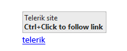
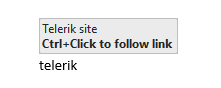
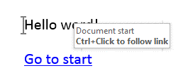

# Hyperlink Field

[Hyperlink](https://docs.telerik.com/devtools/document-processing/api/telerik.windows.documents.flow.model.fields.hyperlink) is a [Field]() element containing a reference to another location by its name. The location can be a web page or a bookmark inside the document.

## Field Syntax

This is how the syntax of a Hyperlink field looks like:

| Syntax   									   |
| :---     									   |
| { **HYPERLINK** "_Filename_" [_Switches_ ] } |

### "Filename"
The destination you want to navigate to.

## Properties

The __Hyperlink__ field exposes the following properties:
        

* **Uri**: Specifies the URI of the hyperlink.           
* **IsAnchor**: Specifies whether the hyperlink points to a bookmark. The value is **true** if the hyperlink is pointing to a bookmark inside the document. Default value is **false**.          
* **ToolTip**: Specifies the hyperlink tooltip.

## Switches

Switches are a way for the code fragment to specify formatting for the result of the field. More information is available in the [Syntax and Switches](https://docs.telerik.com/devtools/document-processing/libraries/radwordsprocessing/concepts/fields/fields#syntax-and-switches) section of the _Fields_ article.

The possible switches for a date field are:

| Switch | Subtype      | Description                                                                                 |
| :---   |  :---        | :---                                                                                        |
| \o     |              | Specifies the tooltip text for the hyperlink                                                |
| \t     |              | Specifies the target that the link should be redirected into                                |
|        | \t "_top"    | Whole page                                                                                  |
|        | \t "_self"   | Same frame                                                                                  |
|        | \t "_blank"  | New window                                                                                  |
|        | \t "_parent" | Parent frame                                                                                |
| \l     |              | Specifies a location in the file, such as a bookmark, where this hyperlink will navigate to |

## Inserting

Inserting a Hyperlink field is easily achieved through the [RadFlowDocumentEditor](). It provides two options for this:
* __InsertHyperlink()__ method. It accepts the hyperlink text, URI, IsAnchor value and tooltip as parameters.

	#### __[C#] Example 1: Insert a Hyperlink using InsertHyperlink method__

	{{region cs-radwordsprocessing-concepts-hyperlink-field_0}}
					
		editor.InsertHyperlink("telerik", "http://www.telerik.com", false, "Telerik site");
	{{endregion}}

	The result looks like shown in **Figure 1**.

	#### Figure 1: Hyperlink inserted in a document
	

	>tipThe  **InsertHyperlink()** method also automatically applies the Hyperlink style to the result fragment of the inserted  field. More information about styles is available in the [Styles]() article.	

* __InsertField()__ method. It accepts code as first argument and result as second argument.

	#### __[C#] Example 2: Insert a Hyperlink field using InsertField method__

	{{region cs-radwordsprocessing-concepts-hyperlink-field_1}}
					
		editor.InsertField(@"HYPERLINK ""http://www.telerik.com"" \o ""Telerik site""", "telerik");
	{{endregion}}

	The result looks like shown in **Figure 2**.

	#### Figure 2: Hyperlink inserted in a document
	
          

Hyperlinks can also point to a [Bookmark]() inside the document. **Example 3** shows how to create a document containing a bookmark and a hyperlink pointing to that bookmark.

#### __[C#] Example 3: Insert a hyperlink pointing to a bookmark__

{{region cs-radwordsprocessing-concepts-hyperlink-field_2}}
	            	            
	// Insert bookmark.
	editor.InsertBookmark("DocumentStart");
	editor.InsertLine("Hello word!");
	            
	// Insert hyperlink pointing to the bookmark.
	editor.InsertHyperlink("Go to start", "DocumentStart", true, "Document start");
{{endregion}}

The result of the above snippet is illustrated in **Figure 3**.

#### Figure 3: Hyperlink and bookmark in a document
  

## See Also

 * [Fields]()
 * [Bookmark]()
 * [RadFlowDocumentEditor]()
