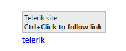
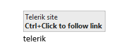
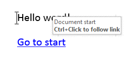

# Hyperlink Field

[Hyperlink](https://docs.telerik.com/devtools/document-processing/api/telerik.windows.documents.flow.model.fields.hyperlink) is a [Field]() element containing a reference to another location by its name. The location can be a web page or a bookmark inside the document.

## Field Syntax

The following table shows the syntax of a Hyperlink field:

| Syntax   									   |
| :---     									   |
| { **HYPERLINK** "_Filename_" [_Switches_ ] } |

### "Filename"
The destination you want to navigate to.

## Properties

The `Hyperlink` field exposes the following properties:

| Property | Description |
|---|---|
| `Uri` | Specifies the URI of the hyperlink. |
| `IsAnchor` | Specifies whether the hyperlink points to a bookmark. `true` if pointing to a bookmark inside the document. Default: `false`. |
| `ToolTip` | Specifies the hyperlink tooltip. |

## Switches

Switches are a way for the code fragment to specify formatting for the result of the field. More information is available in the [Syntax and Switches](https://docs.telerik.com/devtools/document-processing/libraries/radwordsprocessing/concepts/fields/fields#syntax-and-switches) section of the *Fields* article.

The possible switches for a Hyperlink field are:

| Switch | Subtype      | Description                                                                                 |
| :---   |  :---        | :---                                                                                        |
| \o     |              | Specifies the tooltip text for the hyperlink                                                |
| \t     |              | Specifies the target that the link should be redirected into                                |
|        | \t "_top"    | Whole page                                                                                  |
|        | \t "_self"   | Same frame                                                                                  |
|        | \t "_blank"  | New window                                                                                  |
|        | \t "_parent" | Parent frame                                                                                |
| \l     |              | Specifies a location in the file, such as a bookmark, where this hyperlink will navigate to |

## Inserting

You can insert a Hyperlink field through the [RadFlowDocumentEditor](). It provides two options for this:

* `InsertHyperlink()` method: Accepts the hyperlink text, URI, IsAnchor value, and tooltip as parameters.

	**Example 1: Insert a Hyperlink using the InsertHyperlink method**

	<snippet id='libraries-flow-concepts-fields-hyperlink-field-1'/>

	The result looks like shown in **Figure 1**.

	**Figure 1: Hyperlink inserted in a document**

	

	>tip The `InsertHyperlink()` method also automatically applies the Hyperlink style to the result fragment of the inserted field. More information about styles is available in the [Styles]() article.

* `InsertField()` method: Accepts code as first argument and result as second argument.

	**Example 2: Insert a Hyperlink field using the InsertField method**

	<snippet id='libraries-flow-concepts-fields-hyperlink-field-2'/>

	The result looks like shown in **Figure 2**.

	**Figure 2: Hyperlink inserted in a document**

	
          

Hyperlinks can also point to a [Bookmark]() inside the document. **Example 3** shows how to create a document containing a bookmark and a hyperlink pointing to that bookmark.

**Example 3: Insert a hyperlink pointing to a bookmark**

<snippet id='libraries-flow-concepts-fields-hyperlink-field-3'/>

The result of the above snippet is illustrated in **Figure 3**.

**Figure 3: Hyperlink and bookmark in a document**

## See Also

* [Fields]()
* [Bookmark]()
* [RadFlowDocumentEditor]()
