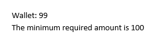

# If Field

[IfField](https://docs.telerik.com/devtools/document-processing/api/telerik.windows.documents.flow.model.fields.iffield) is a [Field]() element that compares two values and inserts the text appropriate to the result of the comparison.

## Field Syntax

This is how the syntax of an If field looks like:

| Syntax   											                   |
| :---     											                   |
| { **IF** _Expression1_ _Operator_ _Expression2_ TrueText FalseText } |

### Operators
In the table bellow are listed all the comparison operators.

| Operator    | Description              |
| :---        | :---                     |
| =           | Equal to                 |
| <>          | Not equal to             |
| >           | Greater than             |
| <           | Less than                |
| >=          | Greater than or equal to |
| <=          | Less than or equal to    |

### Expression1, Expression2
Values to compare.

### TrueText, FalseText
Text that results when the comparison is true (TrueText) or false (FalseText). If FalseText isn't specified and the comparison is false, the IF field has no result. Each string containing multiple words must be enclosed in quotation marks.

## Inserting

Inserting an If field is easily achieved through the [RadFlowDocumentEditor]()'s __InsertField()__ method. It accepts code as first argument and result as second argument. 

#### __[C#] Example 1: Insert If field__

<snippet id='codeblock-bb'/>

The result of the above snippet is illustrated in **Figure 1**.

#### Figure 1: If field in a document
  

## See Also

 * [Fields]()
 * [Custom Code Field]()
 * [RadFlowDocumentEditor]()
