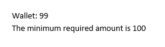

# If Field

[IfField](https://docs.telerik.com/devtools/document-processing/api/telerik.windows.documents.flow.model.fields.iffield) is a [Field]() element that compares two values and inserts the text appropriate to the result of the comparison.

## Field Syntax

The following table shows the syntax of an If field:

| Syntax   											                   |
| :---     											                   |
| { **IF** _Expression1_ _Operator_ _Expression2_ TrueText FalseText } |

### Operators

The following table lists all the comparison operators.

| Operator    | Description              |
| :---        | :---                     |
| =           | Equal to                 |
| <>          | Not equal to             |
| >           | Greater than             |
| <           | Less than                |
| >=          | Greater than or equal to |
| <=          | Less than or equal to    |

### Expression1, Expression2

Values to compare.

### TrueText, FalseText

Text that results when the comparison is true (TrueText) or false (FalseText). If FalseText is not specified and the comparison is false, the IF field has no result. Each string containing multiple words must be enclosed in quotation marks.

## Inserting

You can insert an If field through the `InsertField()` method of [RadFlowDocumentEditor](). The method accepts code as first argument and result as second argument.

**Example 1: Insert a Money bookmark and an IF field that shows a minimum amount message when the value is below 100**

<snippet id='codeblock-bb'/>

The result of the above snippet is illustrated in **Figure 1**.

**Figure 1: If field in a document**

## See Also

* [Fields]()
* [Custom Code Field]()
* [RadFlowDocumentEditor]()
