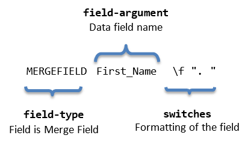

# Merge Field

[MergeField](https://docs.telerik.com/devtools/document-processing/api/telerik.windows.documents.flow.model.fields.mergefield) is a [Field]() element containing a reference to a data field by its name. When a template document is mail merged with the values from a data source, the data field information replaces the merge field. More information on the mail merge feature is available in the respective article: [Mail Merge]().
      

## Field Syntax
This is how the syntax of a If field looks like:

| Syntax   				                 |
| :---     				                 |
| { **MERGEFIELD** FieldName [Switches]} |

The syntax of a merge field is demonstrated in __Figure 1__.
        

#### Figure 1: Merge Field Code Syntax

### "FieldName"
The name of a data field listed in the header record of the selected data source. The field name must exactly match the field name in the header record.

## Switches

Switches are a way for the code fragment to specify formatting for the result of the field. More information is available in the [Syntax and Switches](https://docs.telerik.com/devtools/document-processing/libraries/radwordsprocessing/concepts/fields/fields#syntax-and-switches) section of the _Fields_ article.
        

The possible switches for a Merge field are:

| Switch   | Description                                                                                   |
| :---     | :---                                                                                          |
| \b       | Specifies text, which shall be inserted before the Merge Field in case the field is not blank |
| \f       | Specifies text, which shall be inserted after the Merge Field in case the field is not blank  |
| \m       | Specifies that the MergeField field is a mapped field                                         |
| \v       | Enables character conversion for vertical formatting                                          |
     

## Inserting

Inserting a merge field is easily achieved through the [RadFlowDocumentEditor]()'s __InsertField()__ method. It accepts code as first argument and result as second argument.
  

#### __[C#] Example 1: Insert Merge field__

{{region cs-radwordsprocessing-concepts-merge-field_0}}
	            
	editor.InsertField("MERGEFIELD First_Name", "to be updated");
{{endregion}}
  

#### __[C#] Example 2: Insert Merge field with switches__

{{region cs-radwordsprocessing-concepts-merge-field_1}}
	        
	editor.InsertField("MERGEFIELD First_Name \\b \"Mr. \" \\f \". \"", "to be updated");
{{endregion}}

## See Also

 * [Fields]()
 * [Mail Merge]()
 * [RadFlowDocumentEditor]()
