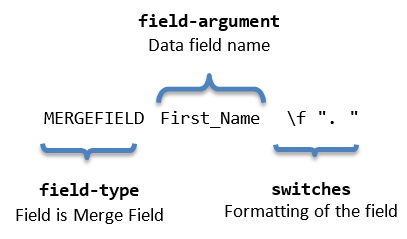

# MergeField Field

[MergeField](https://docs.telerik.com/devtools/document-processing/api/telerik.windows.documents.flow.model.fields.mergefield) is a [Field]() element that contains a reference to a data field by its name. When you mail merge a template document with the values from a data source, the data field information replaces the merge field. For more information on the mail merge feature, see the [Mail Merge]() article.

## Field Syntax

The following table shows the syntax of a Merge field:

| Syntax |
| :--- |
| { **MERGEFIELD** FieldName [Switches]} |

**Figure 1** shows the syntax of a Merge field code.

**Figure 1: Merge Field Code Syntax**

### "FieldName"

The name of a data field listed in the header record of the selected data source. The field name must exactly match the field name in the header record.

## Switches

Switches allow the code fragment to specify formatting for the result of the field. More information is available in the [Syntax and Switches](https://docs.telerik.com/devtools/document-processing/libraries/radwordsprocessing/concepts/fields/fields#syntax-and-switches) section of the *Fields* article.

The possible switches for a Merge field are:

| Switch                 | Description                                                                                   |
| :---                   | :---                                                                                          |
| \@ "Date-Time Picture" | Specifies a date format different from the default format.                                    |
| \\* Format Switch      | Specifies the appearance of the number if different from the default format.                  |
| \b                     | Specifies text that is inserted before the Merge Field if the field is not blank.             |
| \f                     | Specifies text that is inserted after the Merge Field if the field is not blank.              |
| \m                     | Specifies that the MergeField field is a mapped field.                                        |
| \v                     | Enables character conversion for vertical formatting.                                         |

## Inserting

You can insert a Merge field through the `InsertField()` method of [RadFlowDocumentEditor](). The method accepts code as the first argument and result as the second argument.

**Example 1: Insert a Merge field**

<snippet id='libraries-flow-concepts-fields-merge-field-1'/>

**Example 2: Insert a Merge field with switches**

<snippet id='libraries-flow-concepts-fields-merge-field-2'/>

**Example 3: Insert a Merge field with a Date-Time format switch**

<snippet id='libraries-flow-concepts-fields-merge-field-3'/>

After updating the field, the result is "05/13/21".

## See Also

* [Fields]()
* [Mail Merge]()
* [RadFlowDocumentEditor]()

