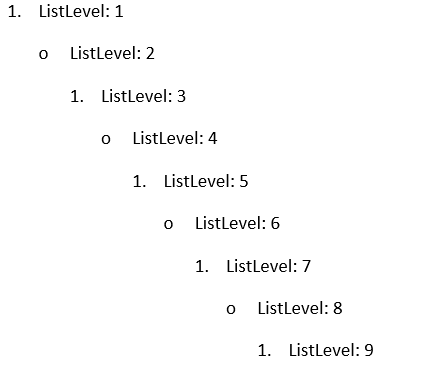

# Lists

A list represents a set of properties that describe the appearance and behavior of a set of numbered paragraphs. All lists are stored in the `ListCollection` accessible through the `Lists` property of [RadFlowDocument]().

* [List Overview](#list-overview)

* [List Types](#list-types)

* [ListLevel Overview](#listlevel-overview)

* [List Templates](#list-templates)

* [Create a List](#create-a-list)

* [Apply List](#apply-list)

## List Overview

The class that contains the structure corresponding to a list is `List` and exposes the following properties:

* `StyleId`: A string property that specifies the [numbering style]() associated with the list.

* `Levels`: Represents a collection of [ListLevel](#listlevel-overview) objects. Every list can contain up to 9 levels.

* `MultilevelType`: The type of the list, described with the [MultilevelType enumeration](https://docs.telerik.com/devtools/document-processing/api/Telerik.Windows.Documents.Flow.Model.Lists.MultilevelType.html). It defines the behavior of the list.

> To insert commonly used types of lists like **bullet** or **numbered** lists, [list templates](#list-templates) can be used.

## List Types

The type of the list is used by an application to determine the user interface behavior for a list and in the `RadWordsProcessing` model is represented by the `MultilevelType` enumeration. The possible types are:

* `HybridMultilevel`: Specifies that the list can contain multiple levels, each from a potentially different type—bullet, decimal, letter, and more. This is the default `MultilevelType` value.

* `Multilevel`: Specifies that the list can contain multiple levels, each of the same type.

* `SingleLevel`: Specifies that only level 1 of the list is used. All other levels are ignored. When a list has `MultilevelType.SingleLevel`, apply the desired list level properties only on the first list level in the `Levels` collection of the `List`.

## ListLevel Overview

[ListLevel](https://docs.telerik.com/devtools/document-processing/api/Telerik.Windows.Documents.Flow.Model.Lists.ListLevel.html) is the class containing the structure of the list levels. It describes a set of properties that specify the appearance and behavior of the associated numbered paragraph.

* `StartIndex`: Specifies the starting number of a `ListLevel`. The value must be equal to or greater than 0.

* `RestartAfterLevel`: Indicates the list level which restarts the current level to its start index. The value must be higher (earlier than this level). The possible values are between 0 and 8 inclusive.

* `NumberTextFormat`: Specifies the number format string for a list level.

* `NumberingStyle`: The numbering style of a list level, described with the [NumberingStyle enumeration](https://docs.telerik.com/devtools/document-processing/api/Telerik.Windows.Documents.Flow.Model.Lists.NumberingStyle.html). It can be a number, bullet, letter, and more. The default value is `NumberingStyle.Bullet`.

* `IsLegal`: Specifies if all inherited number formats display as `NumberingStyle.Decimal` format. If the value is `true`, all numbering levels in the current `ListLevel` are converted to their corresponding decimal values. If the value is `false`, they display in the string format set by the `NumberTextFormat` property.

* `StyleId`: Specifies the name of the [paragraph style]() associated with the list level. `ListLevel` can be associated only with a paragraph style.

* `Alignment`: Specifies the alignment of content in this level.

* `CharacterProperties`: Represents the associated [character properties]().

* `ParagraphProperties`: Represents the associated [paragraph properties]().

## List Templates

There are a set of commonly used lists that are predefined for convenience and are called list templates. All available templates are within the [ListTemplateType enumeration](https://docs.telerik.com/devtools/document-processing/api/Telerik.Windows.Documents.Flow.Model.Lists.ListTemplateType.html).

To add one of the list templates to the document, pass a `ListTemplateType` value to the `ListCollection.Add()` method. This adds the required template to the document and returns the resulting list.

The following example adds a default bulleted list to a predefined `RadFlowDocument`.

**Example 1: Add List Template**

<snippet id='libraries-flow-concepts-lists-1'/>

## Create a List

The following tutorial walks you through the creation of a list.

1. Define a new `RadFlowDocument` and add a `Section` in it.

	**Step 1: Create RadFlowDocument**
	
	<snippet id='libraries-flow-concepts-lists-2'/>

1. Create a `List` object and associate it with the document by adding it to the `Lists` collection.

	**Step 2: Create List**
	
	<snippet id='libraries-flow-concepts-lists-3'/>
	
	In this case, the default `HybridMultilevel` type of list is created.

1. Iterate over the collection of `Levels` the list has.

	**Step 3: Iterate Levels**
	
	<snippet id='libraries-flow-concepts-lists-4'/>

1. Specify some properties for each level.

	**Step 4: Customize List Levels**
	
	<snippet id='libraries-flow-concepts-lists-5'/>
	
	With this step the list is ready to use.

## Apply List

The tutorial in the [previous section](#create-a-list) demonstrates how you can create a `List`. After you create the list, you can apply it to a set of [paragraphs]() by setting the `ListId` property of the paragraphs to the `Id` of the list.

The following example demonstrates how you can apply the list created in Steps 1–4.

**Example 6: Apply List**

<snippet id='libraries-flow-concepts-lists-6'/>

**Figure 1: Result of Example 6**

## See Also

* [RadFlowDocument]()
* [Styles]()
* [Style Properties]()
* [Setting Bullet List Indents in RadWordsProcessing]()
