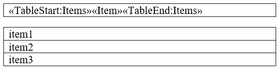
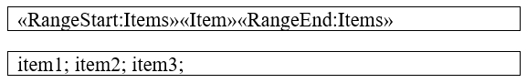
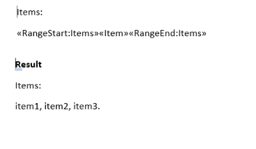
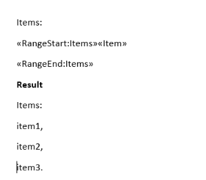

# Mail Merge

[Mail merge](http://en.wikipedia.org/wiki/Mail_merge) is functionality allowing to produce personalized documents from a template holding fixed content and variables. The variables are called [Merge Fields]() and are replaced through the merge process with content from a specified data source.
      

## Inserting Merge Fields

Merge fields are a type of [Fields]() and can be added in a template document via [RadFlowDocumentEditor]()'s __InsertField()__ method. The method requires the code representation of the field and the result which is shown in the template before the document is mail-merged.
        

The code snippet in __Example 1__ shows how to initialize a RadFlodDocumentEditor instance and insert a merge field.
        

#### __[C#] Example 1: Insert a merge field__

{{region cs-radwordsprocessing-editing-mail-merge_0}}
	            
	RadFlowDocument document = CreateDocument();
	RadFlowDocumentEditor editor = new RadFlowDocumentEditor(document);
	editor.InsertField("MERGEFIELD FirstName", "");
{{endregion}}

Additionally, a field can be added to a Paragraph manually by creating a __FieldInfo__ instance and placing its start, code, separator, result and end in the block. __Example 2__ shows the manual approach for adding a merge field.
        

#### __[C#] Example 2: Add a merge field manually__

{{region cs-radwordsprocessing-editing-mail-merge_1}}
	            
	Paragraph paragraph = new Paragraph(document);
	document.Sections.First().Blocks.Add(paragraph);
 
 	FieldInfo field = new FieldInfo(document);
	            
	paragraph.Inlines.Add(field.Start);
	paragraph.Inlines.AddRun("MERGEFIELD LastName");
	paragraph.Inlines.Add(field.Separator);
	paragraph.Inlines.AddRun("");
	paragraph.Inlines.Add(field.End);
{{endregion}}

## Performing Mail Merge

Mail merge can be performed over a template document containing merge fields. For this action the __MailMerge()__ method of [RadFlowDocument]() needs to be used. The method accepts a collection of elements as a parameter.
        

During the operation, each MergeField is replaced with the corresponding information from the data source record in a new __RadFlowDocument__ instance. Every subsequent entry in the data source is appended to a single resulting document which is returned by the method. The original template stays unmodified.
        

Example 3 shows a simple example data source.
        

#### __[C#] Example 3: Sample data source__

{{region cs-radwordsprocessing-editing-mail-merge_2}}
	        
	List<MailMergeRecord> mailMergeDataSource = new List<MailMergeRecord>()
	{
	    new MailMergeRecord()
	    {
	        FirstName = "Andrew",
	        LastName = "Fuller"
	    },
	    new MailMergeRecord()
	    {
		FirstName = "Nancy",
	        LastName = "Davolio"
	    },
	};

 	public class MailMergeRecord
	{
	    public string FirstName { get; set; }
	    public string LastName { get; set; }
	}
{{endregion}}

__Example 4__ performs the mail merge operation over a previously defined template document using the data source from __Example 3__.
        

#### __[C#] Example 4: Perform mail merge__

{{region cs-radwordsprocessing-editing-mail-merge_3}}
	    
	RadFlowDocument mailMergeResult = document.MailMerge(mailMergeDataSource);
{{endregion}}

## Nested Mail Merge

The nested mail merge functionality is supported from R1 2022. It allows you to merge data sources that contain nested data. For example, your business object can contain a list of other objects and this functionality allows accessing the properties of the underlying objects. In order to use the underlying objects, you need to  declare a group. Currently, the following group tags are supported: 

* BeginGroup/EndGroup 
* TableStart/TableEnd
* RangeStart/RangeEnd
* GroupStart/GroupEnd

Currently, all tag pairs work equally and more than one option exists in order to improve the readability of the documents.

>Exception: When a table row has only one cell, using the TableStart/TableEnd tags over the whole content of that cell will create a new row for each value. Every other pair of tags (BeginGroup/EndGroup, RangeStart/RangeEnd, GroupStart/GroupEnd) are interchangeable and will put the values on the same row inside that cell.

>caption A single cell (spanning the whole row) with TableStart/TableEnd tags:

>caption A single cell (spanning the whole row) with a tag group different than TableStart/TableEnd:

The following example demonstrates how you can use the nested mail merge: 

First you need to define a data source that contains an `IEnumerable` of objects.

#### __[C#] Example 5: Nested mail merge data source__

{{region cs-radwordsprocessing-editing-mail-merge_4}}
    public List<Team> GetTeams()
    {
        var teams = new List<Team>();
        var team1 = new Team();
        team1.TeamName = "Team 1";
        team1.Players.Add(new Player() { FirstName = "John", LastName = "Baker" });
        team1.Players.Add(new Player() { FirstName = "Sam ", LastName = "Wayne" });
        teams.Add(team1);

        var team2 = new Team();
        team2.TeamName = "Team 2";
        team2.Players.Add(new Player() { FirstName = "Patrick", LastName = "Gibbs" });
        team2.Players.Add(new Player() { FirstName = "Oscar", LastName = "Stevens" });
        teams.Add(team2);
    
        return teams;
    }
    
    public class Team
    {
        public string TeamName { get; set; }
    
        public List<Player> Players { get; set; }
    
        public Team()
        {
            this.Players = new List<Player>();
        }
    }
    public class Player
    {
        public string FirstName { get; set; }
        public string LastName { get; set; }
    }

{{endregion}}

Now you need to add the fields using the specific supported names. In this example, we are adding the fields to the table and we will use the TableStart/TableEnd tags, but this is not mandatory and you can use a tag of your choosing.

#### __[C#] Example 6: Perform nested mail merge__

{{region cs-radwordsprocessing-editing-mail-merge_5}}

    var document = new RadFlowDocument();
    var editor = new RadFlowDocumentEditor(document);

    editor.InsertParagraph();
    editor.InsertField("MERGEFIELD TeamName", "");
    editor.InsertParagraph();
    editor.InsertText("Players:"); 
    
    var playersTable = editor.InsertTable(2, 2);
    playersTable.PreferredWidth = new TableWidthUnit(TableWidthUnitType.Percent, 100);
    document.StyleRepository.AddBuiltInStyle(BuiltInStyleNames.TableGridStyleId);
    playersTable.StyleId = BuiltInStyleNames.TableGridStyleId;
    
    playersTable.Rows[0].Cells[0].Blocks.AddParagraph().Inlines.AddRun("First Name");
    playersTable.Rows[0].Cells[1].Blocks.AddParagraph().Inlines.AddRun("Last Name");
    
    var firstNameParagraph = playersTable.Rows[1].Cells[0].Blocks.AddParagraph();
    editor.MoveToParagraphStart(firstNameParagraph);
    editor.InsertField("MERGEFIELD TableStart:Players", "");
    editor.InsertField("MERGEFIELD FirstName", "");
    
    var lastNameParagraph = playersTable.Rows[1].Cells[1].Blocks.AddParagraph();
    editor.MoveToParagraphStart(lastNameParagraph);
    editor.InsertField("MERGEFIELD LastName", "");
    editor.InsertField("MERGEFIELD TableEnd:Players", "");
    
    RadFlowDocument mailMergeResult = document.MailMerge(GetTeams());

{{endregion}}

### One Row vs Multiline Mail Merge

With the nested mail merge functionality, it is possible to add all items to a single line. This is achieved by adding the group and regular fields to a single paragraph.

>caption Figure 1: Mail Merging on a single row and the results

If you want to separate the items into several rows you need to close the group on the next row

>caption Figure 2: Mail Merging on multiple rows row and the results

## See Also

 * [Fields]()
 * [Merge Field]()
 * [RadFlowDocument]()
 * [Hiding MailMerge Line in Output Word Document If Blank]()
 * [Inserting Images using Mail Merge]()
 * [Populate a Table with Data using Nested Mail Merge Functionality]()
 * [Generating a Word Document Template with Data Using MailMerge in RadWordsProcessing]()
 * [How to Remove a MERGEFIELD While Replacing the Placeholders with Values in RadWordsProcessing]()
