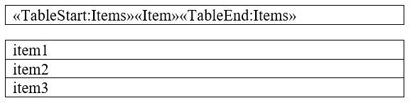
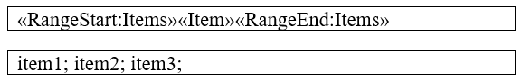
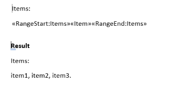
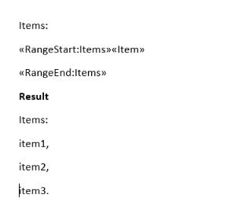

# Mail Merge

[Mail merge](https://en.wikipedia.org/wiki/Mail_merge) is a feature that produces personalized documents from a template holding fixed content and variables. The variables are called [Merge Fields]() and are replaced through the merge process with content from a specified data source.

## Inserting Merge Fields

Merge fields are a type of [Fields]() and can be added in a template document through the `InsertField()` method of [RadFlowDocumentEditor](). The method requires the code representation of the field and the result which is shown in the template before the document is mail-merged.

The code snippet in **Example 1** shows how to initialize a `RadFlowDocumentEditor` instance and insert a merge field.

**Example 1: Create a RadFlowDocumentEditor and insert a MERGEFIELD for FirstName**

<snippet id='codeblock-bu'/>

Additionally, you can add a field to a `Paragraph` manually by creating a `FieldInfo` instance and placing its start, code, separator, result, and end in the block. **Example 2** shows the manual approach for adding a merge field.

**Example 2: Manually construct a MERGEFIELD for LastName with FieldInfo**

<snippet id='codeblock-bv'/>

## Performing Mail Merge

You can perform mail merge over a template document containing merge fields. For this action, use the `MailMerge()` method of [RadFlowDocument](). The method accepts a collection of elements as a parameter.

During the operation, each `MergeField` is replaced with the corresponding information from the data source record in a new `RadFlowDocument` instance. Every subsequent entry in the data source is appended to a single resulting document which is returned by the method. The original template stays unmodified.

**Example 3** shows a sample data source.

**Example 3: Define a sample mail-merge data source with FirstName and LastName values**

<snippet id='codeblock-bw'/>

**Example 4** performs the mail merge operation over a previously defined template document using the data source from **Example 3**.

**Example 4: Run MailMerge over the template document with the sample data source**

<snippet id='codeblock-bx'/>

## Nested Mail Merge

The nested mail merge feature is supported starting with R1 2022. It allows you to merge data sources that contain nested data. For example, your business object can contain a list of other objects and this feature allows you to access the properties of the underlying objects. To use the underlying objects, you need to declare a group. The following group tags are supported:

* BeginGroup/EndGroup
* TableStart/TableEnd
* RangeStart/RangeEnd
* GroupStart/GroupEnd

All tag pairs work equally and more than one option exists to improve the readability of the documents.

> **Exception**: When a table row has only one cell, using the TableStart/TableEnd tags over the whole content of that cell creates a new row for each value. Every other pair of tags (BeginGroup/EndGroup, RangeStart/RangeEnd, GroupStart/GroupEnd) are interchangeable and put the values on the same row inside that cell.

>caption A single cell (spanning the whole row) with TableStart/TableEnd tags:

>caption A single cell (spanning the whole row) with a tag group different than TableStart/TableEnd:

The following example demonstrates how to use nested mail merge.

First, define a data source that contains an `IEnumerable` of objects.

**Example 5: Define a nested mail-merge data source with teams and player collections**

<snippet id='codeblock-by'/>

Then, add the fields using the specific supported names. In this example, the fields are added to the table using the TableStart/TableEnd tags. This is not mandatory and you can use a tag of your choosing.

**Example 6: Build a table-based nested mail-merge template and merge team and player data**

<snippet id='codeblock-bz'/>

### One Row vs Multiline Mail Merge

With the nested mail merge feature, you can add all items to a single line. Add the group and regular fields to a single paragraph.

>caption Figure 1: Mail merge on a single row and the results

To separate the items into several rows, close the group on the next row.

>caption Figure 2: Mail merge on multiple rows and the results

## See Also

* [Fields]()
* [Merge Field]()
* [RadFlowDocument]()
* [Hiding MailMerge Line in Output Word Document If Blank]()
* [Inserting Images using Mail Merge]()
* [Populate a Table with Data using Nested Mail Merge Functionality]()
* [Generating a Word Document Template with Data Using MailMerge in RadWordsProcessing]()
* [How to Remove a MERGEFIELD While Replacing the Placeholders with Values in RadWordsProcessing]()
* [Performing Nested MailMerge with Multiple Levels in RadWordsProcessing]()
* [Simulating Mail Merge with HTML content by Utilizing the Find and Replace Functionality]()
* [Mail Merge with HTML Formatted Strings in RadWordsProcessing]()
