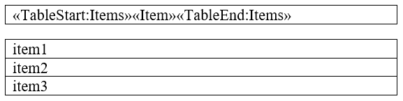
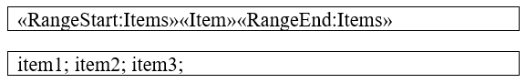
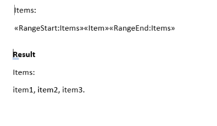
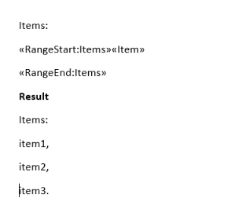

# Mail Merge

Mail merge produces personalized documents from a template that contains fixed content and placeholders. The placeholders are [merge fields](). During the merge process, `RadWordsProcessing` replaces each placeholder with content from a data source.

## Inserting Merge Fields

Merge fields are [field elements]() that you can add to a template document through the `InsertField()` method of [`RadFlowDocumentEditor`](). The method requires the field code and the result that is shown in the template before you run mail merge.

The code snippet in **Example 1** shows how to initialize a `RadFlowDocumentEditor` instance and insert a merge field.

**Example 1: Create a RadFlowDocumentEditor and insert a MERGEFIELD for FirstName**

<snippet id='codeblock-bu'/>

You can also add a field to a `Paragraph` manually. Create a `FieldInfo` instance, then place its start, code, separator, result, and end in the block. **Example 2** shows this approach.

**Example 2: Manually construct a MERGEFIELD for LastName with FieldInfo**

<snippet id='codeblock-bv'/>

## Performing Mail Merge

To perform mail merge, call the `MailMerge()` method of [`RadFlowDocument`](). The method accepts an `IEnumerable` collection of data records.

During the operation, each `MergeField` is replaced with the corresponding value from the current data record in a new `RadFlowDocument` instance. If the data source contains multiple records, the method appends each result to the returned document. The original template remains unchanged.

**Example 3** shows a sample data source.

**Example 3: Define a sample mail-merge data source with FirstName and LastName values**

<snippet id='codeblock-bw'/>

**Example 4** performs the mail merge operation over a previously defined template document using the data source from **Example 3**.

**Example 4: Run MailMerge over the template document with the sample data source**

<snippet id='codeblock-bx'/>

## Nested Mail Merge

The nested mail merge feature is available starting with R1 2022. Use it when your data source contains nested data. For example, a business object can contain a collection of child objects, and nested mail merge lets you access their properties. To reference the child objects, declare one of these group tag pairs:

* `BeginGroup`/`EndGroup`
* `TableStart`/`TableEnd`
* `RangeStart`/`RangeEnd`
* `GroupStart`/`GroupEnd`

All tag pairs work the same way. Multiple options exist to improve document readability.

>important When a table row has only one cell, using `TableStart`/`TableEnd` around the whole cell content creates a new row for each value. The other tag pairs keep the values on the same row inside that cell.

>caption A single cell (spanning the whole row) with TableStart/TableEnd tags:

>caption A single cell (spanning the whole row) with a tag group different than TableStart/TableEnd:

The following example shows how to use nested mail merge.

First, define a data source that contains an `IEnumerable` collection of objects.

**Example 5: Define a nested mail-merge data source with teams and player collections**

<snippet id='codeblock-by'/>

Then, add the fields by using one of the supported group tag pairs. In this example, the fields are added to the table with `TableStart`/`TableEnd`. This is not required, and you can use any supported tag pair.

**Example 6: Build a table-based nested mail-merge template and merge team and player data**

<snippet id='codeblock-bz'/>

### Single-Row and Multiline Mail Merge

With the nested mail merge feature, you can add all items to a single line. Add the group and regular fields to a single paragraph.

>caption Figure 1: Mail merge on a single row and the results

To separate the items into several rows, close the group on the next row.

>caption Figure 2: Mail merge on multiple rows and the results

## See Also

* [Working with Fields]()
* [Merge Field]()
* [RadFlowDocument]()
* [Hiding MailMerge Line in Output Word Document If Blank]()
* [Inserting Images using Mail Merge]()
* [Populate a Table with Data using Nested Mail Merge Functionality]()
* [Generating a Word Document Template with Data Using MailMerge in RadWordsProcessing]()
* [How to Remove a MERGEFIELD While Replacing the Placeholders with Values in RadWordsProcessing]()
* [Performing Nested MailMerge with Multiple Levels in RadWordsProcessing]()
* [Simulating Mail Merge with HTML content by Utilizing the Find and Replace Functionality]()
* [Mail Merge with HTML Formatted Strings in RadWordsProcessing]()
