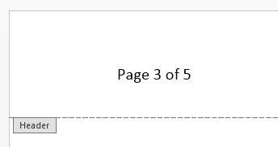
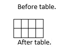
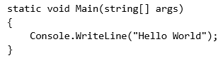

# RadFlowDocumentEditor

Although `RadFlowDocument` can be created and modified by using the style properties and child collections of the document elements, this can be quite cumbersome. `RadFlowDocumentEditor` simplifies this process and achieves the same results with less code. It is also useful when several document elements must be inserted in the right order to ensure the document integrity—for example, when inserting fields, hyperlinks, images, and other elements.

* [Creating and Positioning](#creating-and-positioning)
* [Inserting Document Elements](#inserting-document-elements)
* [Changing Current Styles](#changing-current-styles)


## Creating and Positioning

`RadFlowDocumentEditor` is always associated with a single document, which it takes as a constructor parameter when it is created.

**Example 1: Create a RadFlowDocumentEditor**

<snippet id='codeblock-baba'/>

The editor maintains an internal position inside the document. This position points either inside a paragraph (to an inline) or directly after the end of a table element. The following methods are available for changing the position of the editor within a document:

* `MoveToInlineStart(InlineBase inline)`
* `MoveToInlineEnd(InlineBase inline)`
* `MoveToParagraphStart(Paragraph paragraph)`
* `MoveToParagraphEnd(Paragraph paragraph)`
* `MoveToTableEnd(Table table)`

The code from **Example 2** demonstrates how to position the editor after the second inline in the first paragraph of the document.

**Example 2: Change the Position of RadFlowDocumentEditor**

<snippet id='codeblock-bbbb'/>

You can create a `RadFlowDocumentEditor` for an empty document (one with no sections). In this case, a section and a paragraph are automatically created when you call an insert method. **Example 3** creates a document with one section, containing one paragraph with the text "Hello word!".

**Example 3: Insert Text in a Document**

<snippet id='codeblock-bcbc'/>

## Inserting Document Elements

Most of the insert methods of `RadFlowDocumentEditor` return the newly inserted element. This way you can set additional properties of the element if desired.

### Inserting Text

You can insert text [Runs]() with the following methods:

| Method | Description |
|---|---|
| `InsertText(string text)` | Inserts a new `Run` with the given text in the current paragraph. |
| `InsertLine(string text)` | Inserts a new `Run` with the given text in the current paragraph and starts a new paragraph. |

Both methods return the newly inserted `Run` element. If there are new lines in the text parameter, a new paragraph is also inserted for each new line. In this case, the returned run is the last one that is inserted.

The code in **Example 4** inserts a run containing a new line.

**Example 4: Insert a Run with a New Line**

<snippet id='codeblock-bdbd'/>

The result looks like **Figure 1** shows.

**Figure 1**


>The current [CharacterFormatting](#changing-current-styles) and [ParagraphFormatting](#changing-current-styles) is applied for each `Run` and `Paragraph` that is created.


### Inserting Paragraph

You can start a new [Paragraph]() with the `InsertParagraph()` method. The current `ParagraphFormatting` is applied to the new paragraph and the paragraph is returned.

**Example 5: Insert a Paragraph**

<snippet id='codeblock-bebe'/>

**Figure 2** shows the result from **Example 5**.

**Figure 2: The Content Inserted in Example 5**


If you call the `InsertParagraph()` method while the editor is positioned in the middle of a paragraph, all the inlines after the position are moved inside the new paragraph. The effect is the same as pressing `Enter` while the cursor is in the middle of a paragraph in a text editor application.

### Inserting Sections

You can insert [Section]() elements with the `InsertSection()` method. A paragraph with the new section's properties is added and the new `Section` element is returned.

**Example 6: Insert a Section**
<snippet id='codeblock-bfbf'/>

>If you call the `InsertSection()` method while the editor is positioned in a `TableCell`, the `Table` is split at the current row. This means that if the table contains three rows, and the editor is positioned in a cell which is on the second row, the table is split into two tables—one with one row, which is added to the previous section, and one with two rows (containing the `TableCell` where the editor position was). The latter is added to the newly inserted `Section`.

### Inserting Hyperlinks

Hyperlinks in the `RadFlowDocument` model are [Fields](), which means they have code and result parts separated by [FieldCharacter]() inlines. The `RadFlowDocumentEditor.InsertHyperlink()` method simplifies inserting hyperlinks:

```csharp
public Hyperlink InsertHyperlink(string text, string uri, bool isAnchor, string toolTip)
```

It automatically applies the "Hyperlink" built-in style to the inserted hyperlink if there is no explicitly set style in the `CharacterFormatting` options of the editor.

**Example 7: Insert a Hyperlink**

<snippet id='codeblock-bgbg'/>

**Figure 3: Hyperlink**


### Inserting Code Fields

You can insert fields with the `InsertField()` method, which accepts code and result fragments:

```csharp
public Field InsertField(string code, string result)
```

**Example 8** shows how to add page numbering in the header of a document:

**Example 8: Add Page Numbering in a Header**

<snippet id='codeblock-bhbh'/>

**Figure 4: The Page Numbering Inserted in Example 8**


In this case the result is automatically updated when a document is opened in MS Word, because the page fields are in the header of the document.

>tip You can find an extensive list of field codes in the Office Open XML standard documentation - [ECMA-376](https://www.ecma-international.org/publications/standards/Ecma-376.htm) 4th edition, December 2012, Chapter 17.16.6 Field Definitions.


### Inserting Images

`RadFlowDocumentEditor` provides several methods for inserting [ImageInline]() and [FloatingImage](). All of them return the inserted image element, so that you can perform additional manipulations.

* `InsertImageInline(ImageSource source, Size size)`
* `InsertImageInline(Stream stream, string extension, Size size)`
* `InsertFloatingImage(ImageSource source, Size size)`
* `InsertFloatingImage(Stream stream, string extension, Size size)`

**Example 9** shows how to insert an image using a stream:

**Example 9: Insert an Image from a Stream**

<snippet id='codeblock-bibi'/>

**Figure 5: The Image Inserted in Example 9**


### Inserting Tables

Use the following methods to insert a [Table]() in the document:

| Method | Description |
|---|---|
| `InsertTable()` | Inserts an empty table in the document. |
| `InsertTable(int rows, int columns)` | Inserts a table with the specified number of rows and columns. |

>The formatting specified with the [TableFormatting](#changing-current-styles) property is applied to the inserted table. After the insert operation the editor is automatically placed directly **after** the inserted table (not inside it).


The following example inserts a table with the "TableGrid" built-in style:

**Example 10: Insert a Table with a Style**

<snippet id='codeblock-bjbj'/>


**Figure 6: The Table in the Document**


>tip The `DocumentElementImporter` class allows you to import a document element from one document into another. For more information, refer to [Import Document Element]().


## Changing Current Styles

When you use the insert methods of `RadFlowDocumentEditor`, the editor creates different document elements. You can control the formatting of the newly created elements with the following properties:

| Property | Description |
|---|---|
| `CharacterFormatting` | Applied to all newly created `Run` elements. When inserting hyperlinks, the "Hyperlink" built-in style is applied only if no style is set in `CharacterFormatting`. |
| `ParagraphFormatting` | Applied to all newly created `Paragraph` elements, including paragraphs inserted through `InsertText()` and `InsertLine()`. |
| `TableFormatting` | Applied to all newly created `Table` elements. |

Formatting options are most useful when inserting multiple elements that must have consistent styling. For example, the code from **Example 11** inserts multiple paragraphs with no spacing between them and with text (`Run` elements) in "Consolas" font:

**Example 11: Insert Content with Specified Styles**

<snippet id='codeblock-bkbk'/>


**Figure 7: The Content Inserted in Example 11**


## Deleting Content

**Example 12: Delete Content Between Existing Elements**

<snippet id='codeblock-blbl'/>

The method deletes everything between the "start" and "end" elements. You can choose if the "start" and "end" elements are deleted with the last parameter.

## See Also

* [RadFlowDocumentEditor API Reference](https://docs.telerik.com/devtools/document-processing/api/Telerik.Windows.Documents.Flow.Model.Editing.RadFlowDocumentEditor.html)
* [RadFlowDocument API Reference](https://docs.telerik.com/devtools/document-processing/api/Telerik.Windows.Documents.Flow.Model.RadFlowDocument.html)
* [Document Model]()
* [Find and Replace]()
* [Inserting Formatted HTML Content in another RadFlowDocument using WordsProcessing]()
