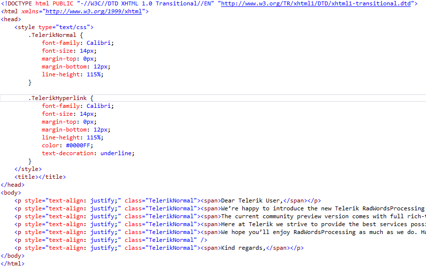

# Html

[HTML](https://en.wikipedia.org/wiki/HTML) (HyperText Markup Language) is a markup language used to create web pages.

`HtmlFormatProvider` is compliant with the [HTML5 specification](https://www.w3.org/TR/html5/), developed by W3C.
