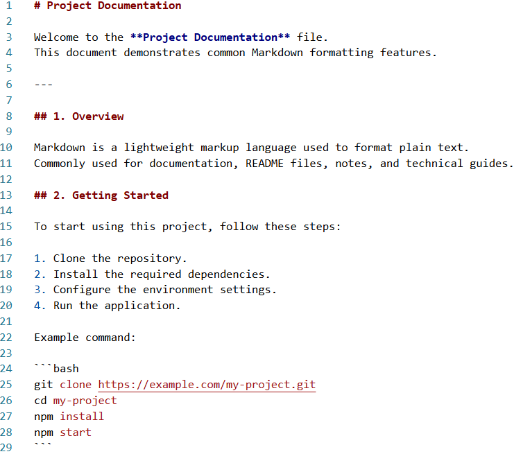

# Markdown

[Markdown](https://en.wikipedia.org/wiki/Markdown) (.md and .markdown) is a lightweight plain-text format for structured documents. Common uses include:

* README files on GitHub, GitLab, Azure DevOps, and similar platforms
* Documentation
* Notes
* Blog posts
* Wiki pages
* Technical instructions
* Formatting text for web publishing

## See Also

* [Using MarkdownFormatProvider]()
* [Settings]()
