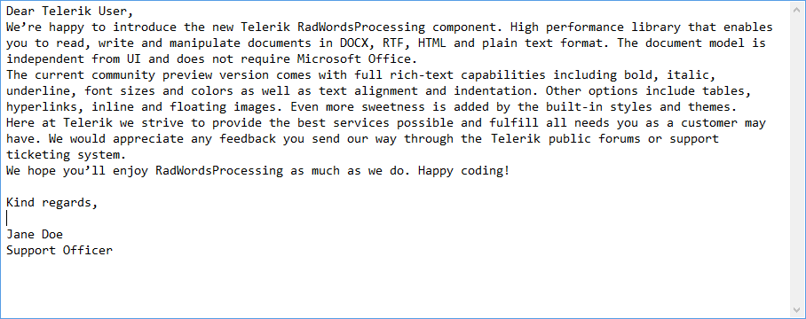

# Plain Text

Plain text is the content of an ordinary sequential document readable as textual material without additional processing.

The `TxtFormatProvider` allows you to extract the text content of a document.

>Starting with **R1 2021**, the provider no longer exports the hyperlink address. Only the hyperlink text is exported, which mimics the behavior in Microsoft Word.
