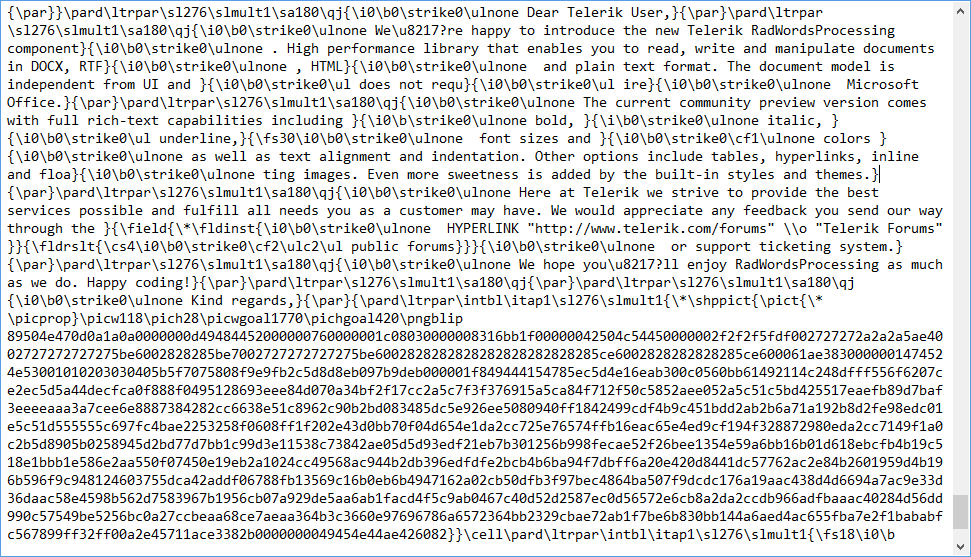

# Rtf

The [Rich Text Format](https://en.wikipedia.org/wiki/Rich_Text_Format) (RTF) is a proprietary document file format developed by Microsoft for creating cross-platform documents. Most word processing applications can read this format.

`RtfFormatProvider` is compliant with [Rich Text Format (RTF) specification version 1.9](https://coolthingoftheday.blogspot.com/2007/01/rtf-19-specification-word-2007.html).
