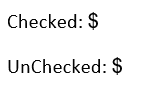

# Content Controls (Structured Document Tags)

Structured Document Tags (SDT) enable you to add specific semantics to part of the document: restricting input, modifying editing behavior, and more.

>note Currently, the WordsProcessing library can import and export content controls from and to Office Open XML (DOCX) format. When exporting to other formats, the content controls are lost, but their content (current value) is preserved.

## Content Controls Inside the Document

The content controls can be defined on [Block](), [Inline](), [Row](), or [Cell]() level. They can be nested inside each other as well. You can also modify the editing behavior of the content controls. This means that you can lock the content of the content control, the entire content control, or both.

## Supported Content Controls

* `Bibliography`
* `CheckBox`
* `Citation`
* `ComboBox`
* `Date`
* `DocumentPart`
* `DocumentPartGallery`
* `DropDownList`
* `Equation`
* `Group`
* `Picture`
* `RichText`
* `Text`
* `RepeatingSection`
* `RepeatingSectionItem`

Microsoft Word does not support the following content controls:

* `Bibliography`
* `Equation`

## Common Content Controls Properties

The above content controls share the following properties:

* `Type`: The type of the current content control.
* `ID`: Each content control must have a unique ID.
* `DataBinding`: Gets or sets an XML mapping (DataBinding) that relates the content of the associated SDT to a specific XML node.
* `Lock`: This property controls if the entire content control or its contents can be edited or deleted. The possible values are:
    * `Unlocked`: The content control can be edited and deleted.
    * `SdtLocked`: The content control can be edited but cannot be deleted.
    * `ContentLocked`: The content control cannot be edited. The entire content control can be deleted.
    * `SdtContentLocked`: The content control cannot be edited or deleted.
* `Alias`: Gets or sets the name for the associated content control (this is necessary because the properties are stored in a separate object).
* `Tag`: Gets or sets a tag for the associated SDT.
* `IsTemporary`: Gets or sets a value that indicates whether this SDT is removed after editing its content.
* `OutlineColor`: Gets or sets the color that is used for visualizing the outline.
* `OutlineAppearance`: Represents the different options for visualizing the outline of a content control. The possible values are:
    * `BoundingBoxes`: The content is wrapped in a bounding box that may also contain a specific editor.
    * `Tags`: The content is wrapped in design view tag.
    * `None`: The content does not have outline visualization.
* `Placeholder`: Gets or sets the associated placeholder object.
    * `ShowPlaceholder`: This property enables or disables the placeholder editing behavior.
    * `PlaceholderText`: This property holds the placeholder text.
* `RunProperties`: These are the properties which are applied to the content of the control after interacting with it. This is relevant for the content controls that generate new content after an interaction, for example, checkbox, combo box, dropdown list, date picker, and repeating section.

## Content Controls with Specific Properties

### CheckBox

The `CheckBox` content control exposes two properties: `CheckedState` and `UncheckedState`. Both properties are of type `SdtCheckBoxState` which allows you to set the respective character and its font. The `Checked` property specifies whether the checkbox is checked.

**Example 1: Setting CheckBox Properties**

<snippet id='codeblock-dhdh'/>

You can visualize the toggle states with any characters specified in the properties. The following example demonstrates a complete code snippet for inserting toggled and untoggled checkboxes:

<snippet id='codeblock-dmdm'/>

### ComboBox and DropDownList

The `ComboBox` and `DropDownList` provide the user with options to choose from. The only difference is that when using `ComboBox` you can add a value that is not defined in the list.

* `Items`: This property allows you to specify the predefined items.
* `LastValue`: This property returns the currently selected value as string.
* `SelectedItem`: This property holds the currently selected item object.
    * `DisplayText`: This property holds the text displayed in the ComboBox or DropDownList.
    * `Value`: This property holds the value, which can be propagated through a data-binding relation.

**Example 2: Setting ComboBox Properties**

<snippet id='codeblock-didi'/>

### Date

The `Date` content control allows you to enter a date by using a calendar. The date content control has the following properties:

* `DateFormat`: Allows you to get or set the format string of the date. If it is omitted, the default date format for the language is used.
* `Language`: Allows you to get or set the `CultureInfo` object for the date format.
* `FullDate`: The current selected date, stored as string.
* `Calendar`: Allows you to select the calendar type.
* `DateMappingType`: Gets or sets the data type (for example, Date, DateTime, and Text) that is used for storing mapped date time value.

**Example 3: Setting Date Properties**

<snippet id='codeblock-djdj'/>

### Text

The `Text` content control allows you to enter plain text. The text content control has the following property:

* `IsMultiline`: Gets or sets a value that indicates whether the SDT supports new lines in its content.

**Example 4: Setting Text Properties**

<snippet id='codeblock-dkdk'/>

### RepeatingSection

The `RepeatingSection` content control has the following properties:

* `SectionTitle`: Gets or sets the title of the section.
* `AllowInsertAndDeleteSections`: Gets or sets a value that indicates whether the underlying sections can be modified.

**Example 5: Setting RepeatingSection Properties**

<snippet id='codeblock-dldl'/>

## See Also

* [Working with Content Controls]()
* [Generating Dynamic DOCX Documents with Tables and CheckBoxes using RadWordsProcessing]()
* [How to Clone and Populate Repeating Section Content Controls in RadWordsProcessing]()
* [Modify the Content of Content Controls (SDTs) using WordsProcessing]()
