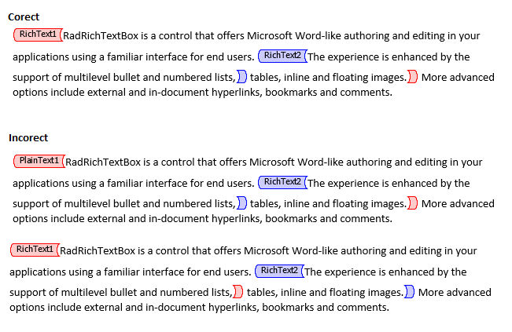

# Working with Content Controls 

This article shows some examples of how you can insert content controls, access existing and modify their properties from the code. 

## Manipulate Existing Content Controls

### Get the Content Controls 

The content controls can be retrieved by using the __EnumerateChildrenOfType()__ method of any document element. 

#### __Example 1: Get all content controls__

<snippet id='codeblock-dndn'/>

### Set Content Controls Properties

This example shows how one can iterate the items and add an item to an existing ComboBox content control. 

#### __Example 2: Adding items to a ComboBox or a DropDownList__

<snippet id='codeblock-dodo'/>

## Insert or Remove Content Controls

New content controls can be inserted through the **InsertStructuredDocumentTag** method of [RadFlowDocumentEditor]().The method has several overloads that allow you to insert the content control by passing its type, properties, and relative document elements. 

>note If adding content controls with the InsertStructuredDocumentTag(SdtType) method without specifying the content, the resulting document will only have the annotation range start and end of the control. The desired content should be manually added afterwards. 

#### __Example 3: Inserting a content control using content control type__

<snippet id='codeblock-dpdp'/>

#### __Example 4: Inserting a Rich Text content control using content control properties__

<snippet id='codeblock-dqdq'/>

#### __Example 5: Inserting a CheckBox content control using content control properties__

<snippet id='codeblock-drdr'/>

#### __Example 6: Remove a content control__

<snippet id='codeblock-dsds'/>

#### __Example 7: Insert a content control to a specific position__

>note When using the InsertStructuredDocumentTag() method and passing start and end elements, make sure that the elements are not already part of a content control.  An exception to the rule are the rich text and repeating section content controls, which can fully contain other controls, with the restriction that they cannot intersect their ranges. 

>caption Figure 1: Examples of correct/incorrect adding of content controls

		

<snippet id='codeblock-dtdt'/>

# See Also
* [Content Controls Overview]()
