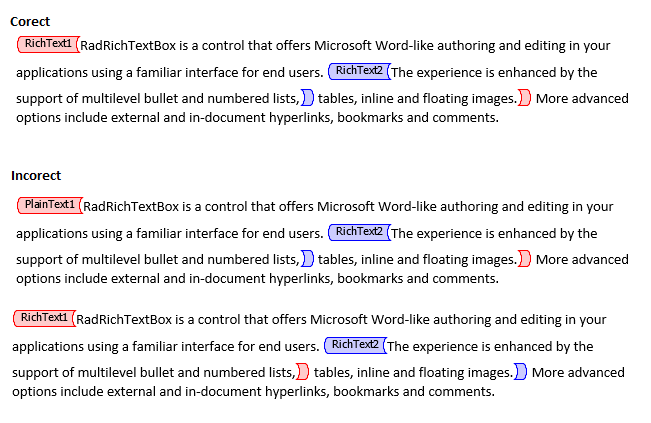

# Working with Content Controls

Content controls let you add structured, reusable regions to a RadWordsProcessing document. You can use them to mark editable areas, constrain input, expose lists such as combo boxes, and prepare document templates for later automation.

This article explains how to retrieve existing content controls, update their properties, insert new controls, remove controls, and place controls at specific positions in the document.

## Manipulate Existing Content Controls

Use the existing document tree when you want to inspect or update content controls that are already part of the document.

### Get the Content Controls

Retrieve content controls by calling `EnumerateChildrenOfType()` on a document element such as the document, section, paragraph, or another container element.

#### **Example 1: Get all content controls**

<snippet id='codeblock-dndn'/>

This approach is useful when you need to find all controls before applying filtering, validation, or targeted updates.

### Set Content Controls Properties

After you retrieve the controls, you can inspect their type and update the matching properties. For example, a combo box or drop-down list control can be updated by adding items to its collection.

#### **Example 2: Adding items to a ComboBox or a DropDownList**

<snippet id='codeblock-dodo'/>

Use the same pattern when you need to modify titles, tags, locking behavior, placeholder content, or other settings exposed by a specific content control type.

## Insert or Remove Content Controls

Insert new content controls through the `InsertStructuredDocumentTag()` method of [RadFlowDocumentEditor](). The available overloads let you insert a control by type, by properties, or by targeting specific document elements.

>note If you call `InsertStructuredDocumentTag(SdtType)` without specifying content, the resulting document contains only the annotation range start and end for the control. Add the intended content after you create the control.

### How to Insert a Content Control by Type

#### **Example 3: Inserting a content control using content control type**

<snippet id='codeblock-dpdp'/>

Use this overload when you know the control type and want to populate its content in a later step.

### How to Insert a Content Control by Properties

#### **Example 4: Inserting a Rich Text content control using content control properties**

<snippet id='codeblock-dqdq'/>

#### **Example 5: Inserting a CheckBox content control using content control properties**

<snippet id='codeblock-drdr'/>

Use the overloads that accept properties when you want to configure the control during insertion instead of modifying it afterwards.

### How to Remove a Content Control

#### **Example 6: Remove a content control**

<snippet id='codeblock-dsds'/>

Removing a content control is useful when you need to clean up document templates or replace one control type with another.

### How to Insert a Content Control at a Specific Position

#### **Example 7: Insert a content control to a specific position**

>note When you use `InsertStructuredDocumentTag()` and pass start and end elements, make sure those elements are not already part of another content control. The exception is rich text and repeating section content controls, which can fully contain other controls as long as their ranges do not intersect.

>caption Figure 1: Examples of correct and incorrect content control placement

<snippet id='codeblock-dtdt'/>

Use element-based insertion when you need exact placement in a document template or when you wrap an existing content range with a new control.

## Common Guidance for Working with Content Controls

Keep these rules in mind when you build document-editing workflows with content controls:

* Retrieve controls from the document tree before you update them, especially when the document can contain multiple control types.
* Choose the insertion overload based on how much configuration you need at creation time.
* Add content after insertion when you create a control only by type.
* Avoid overlapping control ranges unless you use a supported container type such as rich text or repeating section content controls.
* Remove unused controls when you convert a template into a finalized document.

## See Also

* [Content Controls Overview]()
