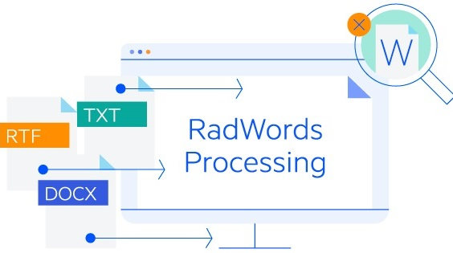
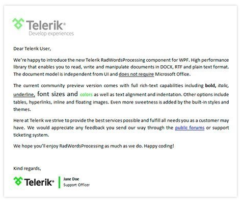

# Overview

**Telerik WordsProcessing Library** allows you to create and modify various document formats like DOCX, RTF, HTML, TXT, convert from one format to another, and export to PDF. Through the API, you can access each element in the document and modify, remove it or add a new one. The generated content you can save as a stream, as a file, or send it to the client browser.

   

>note If you still don't have **Telerik Document Processing installed**, check the [First Steps]() topic to learn how you can obtain the packages through the different suites. 

>note For details on the **usage of the library**, go to the **[Getting Started]()** article.

   

## Key Features 

* Create and modify documents from various document formats: DOCX, RTF, HTML, plain text.
* Convert documents to PDF (export only).
* Convert between the different formats.
* Full rich-text capabilities.
* Font and paragraphs formatting, tables, images, comments, hyperlinks, fields and a lot more are supported.
* Mail merge: Generate documents using template document and a data set, e.g. "Thank you" letters to all employees.
* Merge different documents into a single one controlling how their styles should be merged.
* GenAI-powered Document Insights

The document model of the library provides support for:

|Feature|Description|
|----|----|
|[**Mail Merge**]()|Provides ability to produce personalized documents from a template holding fixed content merged with variable data from a data source (database or any other collection of data items).|
|[**Merge documents**]()|Insert a document into another one at the desired position, controlling the way the styles of both are merged.|
|[**Import of document elements**]()|Import a document element from one document into another.|
|[**Clone**]()| Close documents and document elements.|
|[**Find and Replace**]()|RadWordsProcessing gives you the ability to search for a string in a RadFlowDocument instance and replace all matches. The library also allows you to replace the styling of the matches alone.|
|[**RadFlowDocumentEditor**]()|It is intended to simplify the process of creating and modifying a document and achieve the same results as you would using the style properties and child collections of the document elements with less amount of code.|
|**Formatting**|In addition to the styles, RadWordsProcessing provides support for different types of formatting so you can format any of the document elements: - **Character formatting**: Font size, font color, font name, bold, italic, underline, etc. - **Paragraph formatting**: Line spacing, alignment, indentation, spacing before and after, etc. - **Table formatting**: Enables you to change the alignment, borders, shading, spacing and padding, and more. - **Modifying the section properties** to adjust the page size, orientation, margins, headers and footers, etc.|
|**GenAI-powered Document Insights**|Enables you to easily extract insights from Word documents using Large Language Models (LLMs). This functionality enables you to summarize document content and ask questions about it, with the AI providing relevant answers based on the document's content. [Read More]()|

## Model

The model of **RadWordsProcessing** includes:
            
* [**Sections**](): You can customize the sections using the properties exposed by the corresponding class. The library provides support for customizing the headers, footers, and watermarks for a section as well.

* [**Paragraphs**](): The properties and methods related to paragraphs enable you to change its collection of inlines and appearance.

* [**Tables**](): An API for inserting, editing and removing tables. You can also change their rows, cells, appearance, and content.

* **Inlines**:
	* [Runs]()
	* Images: Including [inline]() and [floating images]().
	* [Fields](): Merge fields, Document Variables and custom code fields, enabling you to insert any fields using its code representation.
	* [Breaks](): Support for different types of breaks, so you can achieve the desired layout.
	* [Bookmarks](): Inserting, modifying and removing bookmarks.
	* [Hyperlinks](): You can work with hyperlinks pointing to a website or to a bookmark inside the document.
	* [Tab stops](): Working with a tab stops collection for each paragraph.

* [**Styles**]()
	* The document model includes a repository of Style objects which contain sets of character, paragraph or table style properties.
	* The API allows you create custom styles and use them throughout the document.
	* [List styles]().

* [**Content Controls**](): Content controls or Structured Document Tags (SDT) enable users to add specific semantics to part of the document: restricting input, modifying editing behavior etc. This functionality allows adding of checkboxes, combo boxes and other controls to the document as well. 

* [**Shapes**](): Their variation in shape and style makes them very useful for drawing attention to specific text.

## Supported formats:

The library comes with support for the following document formats:

* [**DOC & DOT**]() (import only)

* [**DOCX**]()

* [**RTF**]()

* [**HTML**]()

* [**PDF**]() (export only)

* [**Plain text**]()

You can import and export documents of these formats as well as convert the format of the document.

## Online Demos

|Demo|Description|
|----|----|
|[WordsProcessing Basic Usage](https://demos.telerik.com/document-processing/wordsprocessing)|The WordsProcessing API enables effortless conversion of documents between the supported DOCX, RTF, HTML, and TXT formats.|
|[WordsProcessing PDF Export](https://demos.telerik.com/document-processing/wordsprocessing/pdf_export)|This example demonstrates export of documents to PDF using WordsProcessing. You can upload Word(docx), RTF, HTML or plain text document and convert it to PDF.|
|[WordsProcessing Replacement](https://demos.telerik.com/document-processing/wordsprocessing/replace)|This example illustrates the Replace functionality in WordsProcessing. You can import a document of your choice, replace or highlight text in it, using regular expressions or strings and then export the document to view the result.|
|[WordsProcessing Table Of Contents/Authorities](https://demos.telerik.com/document-processing/wordsprocessing/table_of_contents_authorities)|This example illustrates how to add Table of Contents (TOC) of Table of Authorities (TOA) fields in WordsProcessing.|
|[WordsProcessing GenAI Document Insights](https://demos.telerik.com/document-processing/wordsprocessing/genai_document_insights)|This example demonstrates how to use the GenAI-powered Document Insights feature in Telerik RadWordsProcessing to extract meaningful insights from Word documents and receive context-aware responses based on their content.|

# See Also

- [Installing on Your Computer]()
- [First Steps]()
- [Getting Started with RadPdfProcessing]()