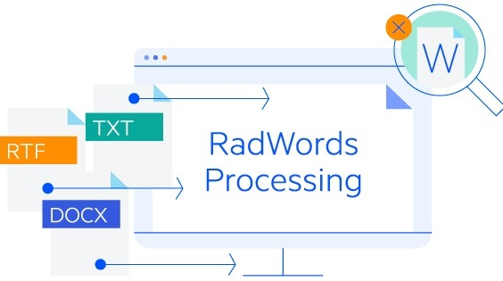
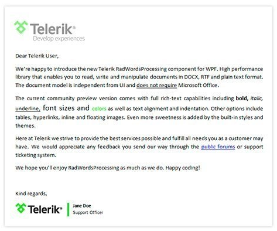

# RadWordsProcessing Overview

**RadWordsProcessing** is the Telerik Document Processing library for creating, editing, importing, converting, and exporting Word-processing documents in .NET applications. Use it when you need programmatic control over document content, formatting, document structure, and format conversion without automating Microsoft Word.

This overview explains what the library does, which document elements it supports, which formats you can work with, and where to continue next based on your scenario.

>note
>
> If you still need to install **Telerik Document Processing**, see [First Steps in Using Telerik Document Processing]() for the available installation options.

>note
>
> For a step-by-step first project, see [Getting Started with RadWordsProcessing]().

## Key Features

Use RadWordsProcessing for these common tasks:

* Create a new `RadFlowDocument` in code.
* Import content from supported document formats.
* Edit document text, structure, formatting, tables, images, fields, and hyperlinks.
* Convert documents between supported formats.
* Export documents to `.docx`, `.rtf`, `.html`, `.txt`, or `.pdf`.
* Generate personalized output through mail merge.
* Merge multiple documents while controlling style resolution.
* Extract insights from documents with GenAI-powered Document Insights.

The following table summarizes the main capabilities that users typically need first:

| Feature | Description |
|----|----|
| [Mail merge]() | Generate personalized documents from a template and a data source such as a database table or object collection. |
| [Merge documents]() | Insert one document into another and control how styles from both documents are combined. |
| [Import document elements]() | Reuse specific elements from one document inside another document. |
| [Clone documents and elements]() | Duplicate documents or individual elements before further processing. |
| [Find and replace]() | Search for text in a `RadFlowDocument` and replace the matches or update their formatting. |
| [RadFlowDocumentEditor]() | Create and modify document content with a higher-level API that reduces manual element management. |
| Formatting support | Apply character, paragraph, table, and section formatting to control the appearance and layout of document content. |
| [GenAI-powered Document Insights]() | Summarize document content and ask questions about a Word document by using Large Language Models (LLMs). |

## Document Model Overview

The RadWordsProcessing model is built around `RadFlowDocument`. Each document contains structured elements that you can create, inspect, and update through the API.

### Block-Level Elements

Use these elements to organize document structure:

| Element | Description |
|----|----|
| [Sections]() | Split a document into logical parts and configure page settings, headers, footers, and watermarks. |
| [Paragraphs]() | Store text and inline content while exposing paragraph-level formatting and layout settings. |
| [Tables]() | Insert and edit rows, cells, layout, borders, spacing, and table content. |

### Inline Elements and Content

Use inline elements to control the content that appears inside paragraphs:

| Element | Description |
|----|----|
| [Runs]() | Hold text with specific character formatting. |
| [Inline images]() and [floating images]() | Insert pictures that flow with text or float independently on the page. |
| [Fields]() | Insert merge fields, document variables, and custom code fields. |
| [Breaks]() | Control line, page, and other document breaks. |
| [Bookmarks]() | Add named locations that you can target from other content. |
| [Hyperlinks]() | Link to websites or bookmarks inside the same document. |
| [Tab stops]() | Control horizontal alignment points within a paragraph. |

### Styles, Controls, and Shapes

Use these features to extend formatting and document behavior:

| Feature | Description |
|----|----|
| [Styles]() | Define reusable character, paragraph, and table styles, including [list styles](). |
| [Content controls]() | Add Structured Document Tags (SDT) such as checkboxes and combo boxes and apply editing constraints. |
| [Shapes]() | Add visual elements that highlight or emphasize content. |

## Supported Formats

RadWordsProcessing supports these formats for import, export, or both:

| Format | Support |
|----|----|
| [DOC and DOT]() | Import only |
| [DOCX]() | Import and export |
| [RTF]() | Import and export |
| [HTML]() | Import and export |
| [PDF]() | Export only |
| [Plain text]() | Import and export |

Use the corresponding format providers when you need to open an existing document, save a generated document, or convert content from one format to another.

## Typical Next Steps

Most users continue with one of these paths:

1. Start with [RadWordsProcessing Getting Started with DOCX Export]() if you want a first working sample.
2. Review [Formats and Conversion]() if you need to import or export a specific file format.
3. Explore the [RadWordsProcessing Model]() if you plan to build or edit documents in code.
4. Browse [Developer Focused Examples]() if you want larger end-to-end scenarios.

## Online Demos

Review these demos to see the library in action:

| Demo | Description |
|----|----|
| [WordsProcessing Basic Usage](https://demos.telerik.com/document-processing/wordsprocessing) | Convert documents between the supported DOCX, RTF, HTML, and TXT formats. |
| [WordsProcessing PDF Export](https://demos.telerik.com/document-processing/wordsprocessing/pdf_export) | Upload a Word, RTF, HTML, or plain-text document and export it to PDF. |
| [WordsProcessing Replacement](https://demos.telerik.com/document-processing/wordsprocessing/replace) | Replace or highlight text by using strings or regular expressions and then export the result. |
| [WordsProcessing Table of Contents and Authorities](https://demos.telerik.com/document-processing/wordsprocessing/table_of_contents_authorities) | Insert Table of Contents (TOC) and Table of Authorities (TOA) fields. |
| [WordsProcessing GenAI Document Insights](https://demos.telerik.com/document-processing/wordsprocessing/genai_document_insights) | Use GenAI-powered Document Insights to summarize documents and answer questions about their content. |

## See Also

- [Installing on Your Computer]()
- [First Steps in Using Telerik Document Processing]()
- [RadWordsProcessing Getting Started with DOCX Export]()
- [Formats and Conversion]()
