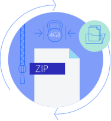
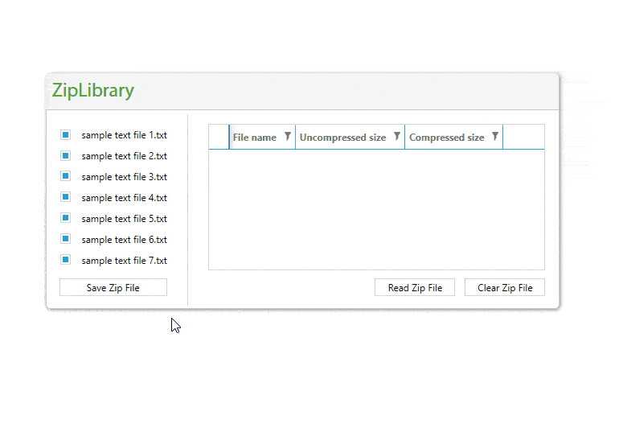

# Overview

With **RadZipLibrary**, you can compress and archive images, DOCX, or PDF files. You can create and edit new ZIP files or load and extract data from existing ZIP archives. The library includes support for large files, encryption, and more.

You can compress data like images, DOCX, or PDF files and send them over the wire to achieve fast and secure transactions.

## Key Features

The following list shows the key features of **RadZipLibrary**:

* **Flexible API**: The library exposes a flexible API that gives you full control over the compressed data. The [extension methods]() allow you to implement the most common scenarios in a single line of code, such as creating a ZIP file from a folder or extracting it.

* **Load or create ZIP files**: You can load data from existing ZIP files, create new ones, and edit ZIPs that can be used by other applications. You can also create ZIP files in memory or add data to a ZIP file from a stream.

* [**Compress a stream**](): **RadZipLibrary** can help you compress a stream, for example, to send it over the internet.

* **Support for large files**: The **ZipLibrary** works with large files (over 4 GB).

* **Support for [encryption]()**: You can protect your ZIP file with a password for more security.

>note If you do not have **Telerik Document Processing** installed, check the **[First Steps]()** topic to learn how you can get the packages through the different suites.

>note For details on the **usage of the library**, go to the **[Getting Started]()** article.

## Online Demos

The following table lists the available online demos:

| Demo | Description |
|---|---|
| [ZipLibrary Basic Usage](https://demos.telerik.com/document-processing/ziplibrary) | The ZipLibrary allows your application to read all the data from a ZIP file simultaneously and display the information about the compressed files in a grid. |
| [ZipLibrary Stream Compression](https://demos.telerik.com/document-processing/ziplibrary/compress_stream) | This example shows how to compress streams with the preferred compression level. |
| [ZipLibrary Archive Protection](https://demos.telerik.com/document-processing/ziplibrary/archive_protection) | The ZipLibrary lets you password-protect and open a ZIP archive with a password. |
