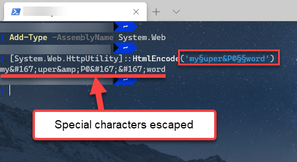
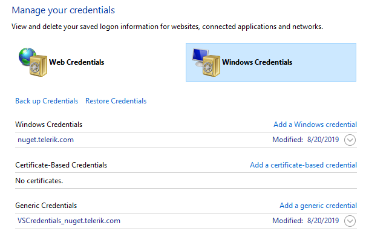

# Troubleshooting Telerik NuGet

This article provides solutions to common issues that you may observe when working with the Telerik NuGet server and the NuGet packages that it provides.

## Issue: The NuGet Package Takes Too Long to Install or Update on Visual Studio

The NuGet package takes too long to install or update on Visual Studio. The following steps can improve the installation and update times:

### Solution

* Disable the auto-sync in the `_references.js` file by modifying the following `/// <autosync enabled="false" />` line.
* You can also disconnect the project from the source control before running the Update Wizard.

## Issue: Telerik NuGet Returns 401 Logon Failed after Password Change

After changing your Telerik password, you get `[Telerik Nuget] The V2 feed at '...' returned an unexpected status code '401 Logon failed.'` error in the NuGet Package Manager.

### Solution

After changing your Telerik password, you must reset your credentials in the `NuGet.config` file. To do this, run the `NuGet Sources Update -Name "telerik.com" -Source "https://nuget.telerik.com/v3/index.json" -UserName "your login email" -Password "your new password"` command.

The password must contain only ASCII characters.

As an alternative, you can [reset your Telerik NuGet Feed credentials from the Windows Credentials Manager](#solution-2-windows-credentials-manager).

## 401 Logon Failed Error

If you receive this error when connecting to Telerik NuGet Server, you can try to update your NuGet credentials through the **Windows Credential Manager**.

1. Close all open Visual Studio instances (this stops all NuGet package manager tasks).
2. Open the **Credential Manager** app on your PC.
3. Scroll through all the entries until you find any that are for `nuget.telerik.com`.
4. Once you find that entry, expand it and select **Edit**.
5. Verify that the username and password are the same ones you use for your Telerik account:
    1. Use the email address in the place of username.
    2. Verify that any special characters are escaped (see *Handling Special Characters in Password* below).
    3. Click **Save**.
6. Verify that the URL does not have a trailing slash. It must be only `https://nuget.telerik.com/nuget`.
7. Reopen Visual Studio and access the Telerik NuGet server.

## Handling Special Characters in Password

If your password contains a special character, those characters need to be escaped or authentication may fail with *Error 401 login failure* from the NuGet server. A common character that needs to be escaped is the ampersand `&`, but it can be as unique as the section character `§`. There are two ways to handle this:

* Change the password so that it only includes characters that do not need to be escaped.
* HTML encode the password so the special characters are escaped (for example, `my§uper&P@§§word` becomes `my&sect;uper&amp;P@&sect;&sect;word`).

Do **not** enter your password into an online encoder utility. Use PowerShell instead:

```powershell
Add-Type -AssemblyName System.Web
[System.Web.HttpUtility]::HtmlEncode('my§uper&P@§§word') 
```



## Issue: Unable to Load the Service Index for Source https://nuget.telerik.com/v3/index.json

Verify that the Telerik NuGet Feed is live at [https://status.telerik.com/](https://status.telerik.com/).

## Issue: Resetting Telerik NuGet Credentials

On Windows, if you enter and save wrong credentials for the Telerik NuGet or if you change your Telerik credentials, you do not have access to the desired NuGet packages. Before you can enter the correct username and password, you must clear the saved credentials.

### Solution 1: Resetting the Credentials in NuGet.config

Try resetting your credentials by using the approach suggested in the [Telerik NuGet returns 401 Logon failed after password change](#issue-telerik-nuget-returns-401-logon-failed-after-password-change) section. If the credentials are not updated, continue with [Solution 2](#solution-2-windows-credentials-manager) below.

### Solution 2: Windows Credentials Manager

Alternatively, use Windows Credentials Manager to remove the saved credentials:

1. In Visual Studio, navigate to **Tools** > **NuGet Package Manager** > **Package Manager Settings**. Select **NuGet Package Manager**, click **Package Sources**, and remove the listed Telerik NuGet package source.
1. Close Visual Studio.
1. Open the Windows Credentials Manager. To access it, navigate to **Control Panel** > **User Accounts** > **Credential Manager**.
1. Click **Windows Credentials**.
1. Remove the following saved credentials:
    * `nuget.telerik.com`
    * `VSCredentials_nuget.telerik.com`

      
1. Add the Telerik NuGet Feed again, and then enter the correct credentials. For more details, see the [Available NuGet Packages]() article.
1. If desired, verify the NuGet credentials by inspecting the `NuGet.config` file located in `%AppData%\NuGet\NuGet.config`.

## Networking Problems

Another common problem is that your machine (PC, GitHub Actions runner, or Azure DevOps agent) is behind a proxy. To check if you are experiencing a networking issue, open the following URL in your web browser:

* https://nuget.telerik.com/nuget/Search()?$filter=IsAbsoluteLatestVersion&searchTerm=%27WPF%27&includePrerelease=true&$skip=0&$top=100&semVerLevel=2.0.0. 

After you enter your telerik.com username and password, you see an XML search result that contains a list of all the Telerik.UI.for.WPF packages available with your license.

## See Also

* [Resolving Namespace Conflicts in Telerik Document Processing Libraries]()